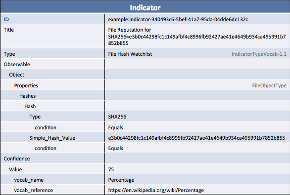

Although there are variations, reputation services generally present information about a single data point (IP address, file by hash, e-mail, URLs, and domains) and how likely it is that that data point is "malicious". As you might expect, that's the perfect use case for a STIX [Indicator](/data-model/{{site.current_version}}/indicator/IndicatorType) and so that will be the focus of this idiom. If you're not already familiar with basic STIX indicators, read the [Indicator for C2 IP Address](/documentation/idioms/c2-indicator) for some background on creating indicators in general.

This idiom will cover some specific cases that many reputation services have to deal with:

- Where the reputation score itself goes
- How custom scoring systems or vocabularies are represented

Keep in mind that many reputation services are request/response: the consumer asks for information about a single hash and the producer creates a response specific to that hash. This idiom only describes the "response" part of that cycle. To see a more transport-oriented view of this idiom that incorporates TAXII, take a look at their [TAXII Service Profile for IP Reputation](http://taxiiproject.github.io/documentation/service-profiles/file-hash-rep/). This STIX idiom is a subset of that that goes into more detail on the STIX side.

**Shortcut: Already very comfortable creating or parsing indicators? Reputation services are just an indicator with a "Confidence" field that indicates the score itself (use a custom vocabulary if you need to).**

## Data model

The basic data model is the same as for most indicators:

- A top-level indicator to bring together:
  - A CybOX object to represent the data point
  - An indicated TTP on the indicator to describe how the object is malicious
  - A confidence to indicate the reputation score (the likelihood that the object is malicious)

### Indicator Framework

The `Indicator` forms the framework for the reputation result. All of the other data will be added under that.


<stix:Indicator id="example:indicator-14975dea-86cd-4211-a5f8-9c2e4daab69a" timestamp="2015-07-20T19:52:13.853585+00:00" xsi:type='indicator:IndicatorType'>
    <indicator:Title>File Reputation for SHA256=e3b0c44298fc1c149afbf4c8996fb92427ae41e4649b934ca495991b7852b855</indicator:Title>
    <indicator:Type xsi:type="stixVocabs:IndicatorTypeVocab-1.1">File Hash Watchlist</indicator:Type>
</stix:Indicator>

indicator = Indicator(title="File Reputation for SHA256=e3b0c44298fc1c149afbf4c8996fb92427ae41e4649b934ca495991b7852b855")
indicator.add_indicator_type("File Hash Watchlist")

indicator = stix_package.indicators[0]


### The object itself

This is essentially just a normal indicator, so for more background see the [Indicator for C2 IP Address idiom](/documentation/idioms/c2-indicator/).

In particular, because this is an indicator keep in mind that all of the fields on the CybOX object MUST have a `@condition` explicitly set. In most cases (such as for single IP addresses, file hashes, and URLs) the condition can just be "Equals".

In this example, the SHA256 hash for the file is given along with the notation that the match should (of course, because it's a hash) be an equality match:


<indicator:Observable id="example:Observable-7b97c8a2-2d0b-4af7-bcf0-cad28f2fea5a">
    <cybox:Object id="example:File-b04bfc7c-04ae-4dfe-ba8e-a297f0717552">
        <cybox:Properties xsi:type="FileObj:FileObjectType">
            <FileObj:Hashes>
                <cyboxCommon:Hash>
                    <cyboxCommon:Type condition="Equals" xsi:type="cyboxVocabs:HashNameVocab-1.0">SHA256</cyboxCommon:Type>
                    <cyboxCommon:Simple_Hash_Value condition="Equals">e3b0c44298fc1c149afbf4c8996fb92427ae41e4649b934ca495991b7852b855</cyboxCommon:Simple_Hash_Value>
                </cyboxCommon:Hash>
            </FileObj:Hashes>
        </cybox:Properties>
    </cybox:Object>
</indicator:Observable>

file_hash = 'e3b0c44298fc1c149afbf4c8996fb92427ae41e4649b934ca495991b7852b855'
file_object = File()
file_object.add_hash(Hash(file_hash))
file_object.hashes[0].simple_hash_value.condition = "Equals"
file_object.hashes[0].type_.condition = "Equals"
indicator.add_observable(file_object)

print "Hash: " + indicator.observable.object_.properties.hashes[0].simple_hash_value.value


### Indicated TTP

To make indicators more useful it's strongly suggested that an `Indicated_TTP` be included on the indicator. This is a relationship that points to the [TTP](/data-model/{{site.current_version}}/ttp/TTPType) construct to describe what about the object is bad: maybe it's a piece of malware, maybe it's an IP used for C2, maybe it's an e-mail address used for spear phishing. In rare cases it might be impossible for a producer to create this information and, in those cases, it may be omitted.


<indicator:Indicated_TTP>
    <stixCommon:TTP id="example:ttp-23e715a9-24c8-4b21-ba5b-f564d2edc660" timestamp="2015-07-20T19:52:13.854415+00:00" xsi:type='ttp:TTPType'>
        <ttp:Title>Malicious file</ttp:Title>
    </stixCommon:TTP>
</indicator:Indicated_TTP>

indicator.add_indicated_ttp(TTP(title="Malicious file"))

print "TTP: " + indicator.indicated_ttps[0].item.title


### Reputation score

For almost all reputation services, the reputation score isn't _how bad_ the indicated object is but _how likely it is_ that the object is bad. In the indicator context, this data is represented on the `Confidence` field (which can in some ways be thought of as a synonym for `Indicated_TTP/Confidence`). This field can either use the default vocabulary ([HighMediumLow](/data-model/{{site.current_version}}/stixVocabs/HighMediumLowVocab-1.0/)) or a custom vocabulary to represent a different scoring system.

When using a custom vocabulary, the `@vocab_name` field represents the name of the scoring system and the `@vocab_reference` field represents a URL to something that defines the scoring system. In this example, we just use a placeholder link to Wikipedia but in a real service it should be set to the documentation for the scoring system so that consumers can understand the score that they get.


<indicator:Confidence timestamp="2015-07-20T18:30:25.439498+00:00">
    <stixCommon:Value vocab_reference="https://en.wikipedia.org/wiki/Percentage" vocab_name="Percentage">75</stixCommon:Value>
</indicator:Confidence>

indicator.confidence = Confidence(value=VocabString('75'))
indicator.confidence.value.vocab_name = "Percentage"
indicator.confidence.value.vocab_reference = "https://en.wikipedia.org/wiki/Percentage"

print "Reputation: " + indicator.confidence.value.value


## Putting it all together

Here's the whole thing in one big chunk:


<stix:Indicator id="example:indicator-14975dea-86cd-4211-a5f8-9c2e4daab69a" timestamp="2015-07-20T19:52:13.853585+00:00" xsi:type='indicator:IndicatorType'>
    <indicator:Title>File Reputation for SHA256=e3b0c44298fc1c149afbf4c8996fb92427ae41e4649b934ca495991b7852b855</indicator:Title>
    <indicator:Type xsi:type="stixVocabs:IndicatorTypeVocab-1.1">File Hash Watchlist</indicator:Type>
    <indicator:Observable id="example:Observable-7b97c8a2-2d0b-4af7-bcf0-cad28f2fea5a">
        <cybox:Object id="example:File-b04bfc7c-04ae-4dfe-ba8e-a297f0717552">
            <cybox:Properties xsi:type="FileObj:FileObjectType">
                <FileObj:Hashes>
                    <cyboxCommon:Hash>
                        <cyboxCommon:Type condition="Equals" xsi:type="cyboxVocabs:HashNameVocab-1.0">SHA256</cyboxCommon:Type>
                        <cyboxCommon:Simple_Hash_Value condition="Equals">e3b0c44298fc1c149afbf4c8996fb92427ae41e4649b934ca495991b7852b855</cyboxCommon:Simple_Hash_Value>
                    </cyboxCommon:Hash>
                </FileObj:Hashes>
            </cybox:Properties>
        </cybox:Object>
    </indicator:Observable>
    <indicator:Indicated_TTP>
        <stixCommon:TTP id="example:ttp-23e715a9-24c8-4b21-ba5b-f564d2edc660" timestamp="2015-07-20T19:52:13.854415+00:00" xsi:type='ttp:TTPType'>
            <ttp:Title>Malicious file</ttp:Title>
        </stixCommon:TTP>
    </indicator:Indicated_TTP>
    <indicator:Confidence timestamp="2015-07-20T19:52:13.854506+00:00">
        <stixCommon:Value vocab_reference="https://en.wikipedia.org/wiki/Percentage" vocab_name="Percentage">75</stixCommon:Value>
    </indicator:Confidence>
</stix:Indicator>

file_hash = 'e3b0c44298fc1c149afbf4c8996fb92427ae41e4649b934ca495991b7852b855'

indicator = Indicator(title="File Reputation for SHA256=e3b0c44298fc1c149afbf4c8996fb92427ae41e4649b934ca495991b7852b855")
indicator.add_indicator_type("File Hash Watchlist")

file_object = File()
file_object.add_hash(Hash(file_hash))
file_object.hashes[0].simple_hash_value.condition = "Equals"
file_object.hashes[0].type_.condition = "Equals"
indicator.add_observable(file_object)

indicator.confidence = Confidence(value=VocabString('75'))
indicator.confidence.value.vocab_name = "Percentage"
indicator.confidence.value.vocab_reference = "https://en.wikipedia.org/wiki/Percentage"


stix_package = STIXPackage.from_xml('file-hash-reputation.xml')
for indicator in stix_package.indicators:
  print "Hash: " + indicator.observable.object_.properties.hashes[0].simple_hash_value.value
  print "Reputation: " + indicator.confidence.value.value


[Full XML](file-hash-reputation.xml) | [Python Producer](file-hash-reputation_producer.py) | [Python Consumer](file-hash-reputation_consumer.py)

## Further Reading

* [Indicator Type](/data-model/{{site.current_version}}/indicator/IndicatorType)
* [Indicator for C2 IP Address](/documentation/idioms/c2-indicator)
