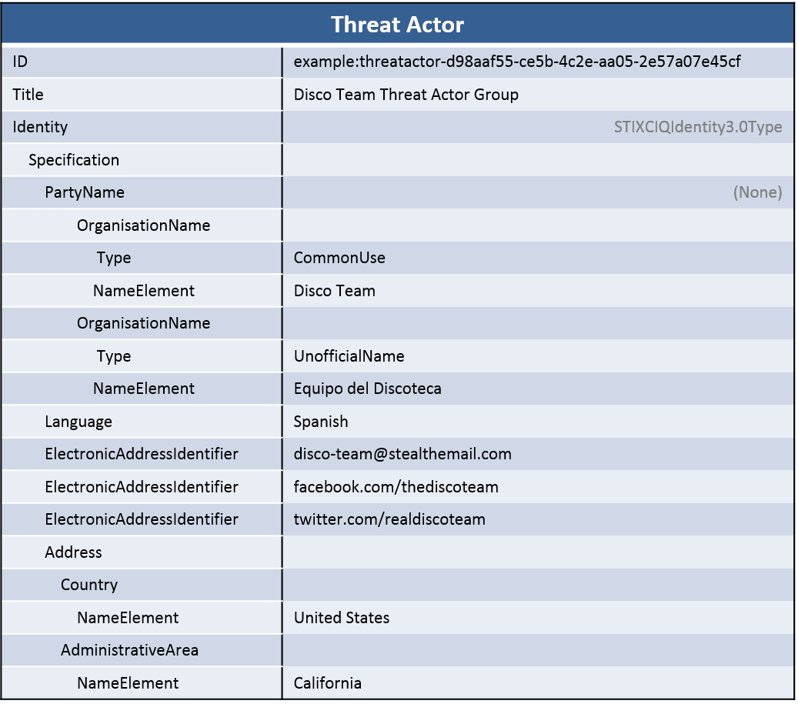

Commercial threat intelligence providers and well-resourced government agencies often attribute malicious activity to a particular threat actor or actor group.Data model

## Scenario

In this scenario, the STIX represents a threat actor group named "Disco Team" that operates primarily in Spanish. They use the e-mail alias "disco-team@stealthemail.com" publicly and are known alternatively as "Equipo del Discoteca". Several references indicate that they are based primarily in Southern California.

## Data model

Threat actor identification is, as you would expect, represented using the STIX [Threat Actor](/data-model/{{site.current_version}}/ta/ThreatActorType) component. More specifically, the `Identity` field, which uses the [IdentityType](/data-model/{{site.current_version}}/stixCommon/IdentityType) extension point, is the field that contains information about the identity of the actor. Other fields in threat actor describe what the actor targets, how sophisticated it is, and other information about it.

The STIX default extension for identity is [OASIS CIQ](https://www.oasis-open.org/committees/tc_home.php?wg_abbrev=ciq) implemented via the [CIQIdentity3.0InstanceType](/data-model/{{site.current_version}}/stix-ciqidentity/CIQIdentity3.0InstanceType). Using this extension point, the threat actor identity is characterized in CIQ within the `Specification` field.

## Implementation


<stix:STIX_Package >
     <stix:Threat_Actors>
        <stix:Threat_Actor id="example:threatactor-dfaa8d77-07e2-4e28-b2c8-92e9f7b04428" timestamp="2014-11-19T23:39:03.893348+00:00" xsi:type='ta:ThreatActorType' version="1.2">
            <ta:Title>Disco Team Threat Actor Group</ta:Title>
            <ta:Identity id="example:Identity-733c5838-34d9-4fbf-949c-62aba761184c" xsi:type='stix-ciqidentity:CIQIdentity3.0InstanceType'>
                <ExtSch:Specification xmlns:ExtSch="http://stix.mitre.org/extensions/Identity#CIQIdentity3.0-1">
  <xpil:PartyName xmlns:xpil="urn:oasis:names:tc:ciq:xpil:3">
    <xnl:OrganisationName xmlns:xnl="urn:oasis:names:tc:ciq:xnl:3" xnl:Type="CommonUse">
      <xnl:NameElement>Disco Tean</xnl:NameElement>
    </xnl:OrganisationName>
    <xnl:OrganisationName xmlns:xnl="urn:oasis:names:tc:ciq:xnl:3" xnl:Type="UnofficialName">
      <xnl:NameElement>Equipo del Discoteca</xnl:NameElement>
    </xnl:OrganisationName>
  </xpil:PartyName>
  <xpil:Addresses xmlns:xpil="urn:oasis:names:tc:ciq:xpil:3">
    <xpil:Address>
      <xal:Country xmlns:xal="urn:oasis:names:tc:ciq:xal:3">
        <xal:NameElement>United States</xal:NameElement>
      </xal:Country>
      <xal:AdministrativeArea xmlns:xal="urn:oasis:names:tc:ciq:xal:3">
        <xal:NameElement>California</xal:NameElement>
      </xal:AdministrativeArea>
    </xpil:Address>
  </xpil:Addresses>
  <xpil:ElectronicAddressIdentifiers xmlns:xpil="urn:oasis:names:tc:ciq:xpil:3">
    <xpil:ElectronicAddressIdentifier>disco-team@stealthemail.com</xpil:ElectronicAddressIdentifier>
    <xpil:ElectronicAddressIdentifier>facebook.com/thediscoteam</xpil:ElectronicAddressIdentifier>
  </xpil:ElectronicAddressIdentifiers>
  <xpil:Languages xmlns:xpil="urn:oasis:names:tc:ciq:xpil:3">
    <xpil:Language>Spanish</xpil:Language>
  </xpil:Languages>
</ExtSch:Specification>
            </ta:Identity>
        </stix:Threat_Actor>
    </stix:Threat_Actors>
</stix:STIX_Package>



stix_package = STIXPackage()
ta = ThreatActor()
ta.title = "Disco Team Threat Actor Group"

ta.identity = CIQIdentity3_0Instance()
identity_spec = STIXCIQIdentity3_0()

identity_spec.party_name = PartyName()
identity_spec.party_name.add_organisation_name(OrganisationName("Disco Tean", type_="CommonUse"))
identity_spec.party_name.add_organisation_name(OrganisationName("Equipo del Discoteca", type_="UnofficialName"))

identity_spec.add_language("Spanish")

address = Address()
address.country = Country()
address.country.add_name_element("United States")
address.administrative_area = AdministrativeArea()
address.administrative_area.add_name_element("California")    
identity_spec.add_address(address)

identity_spec.add_electronic_address_identifier("disco-team@stealthemail.com")
identity_spec.add_electronic_address_identifier("facebook.com/thediscoteam")
identity_spec.add_electronic_address_identifier("twitter.com/realdiscoteam")
    
ta.identity.specification = identity_spec
stix_package.add_threat_actor(ta)
print stix_package.to_xml()


print "== ACTOR =="
for actor in pkg.threat_actors:
    print "Actor: " + actor.title
    for name in actor.identity.specification.party_name.organisation_names:
        print "AKA: "+ str(name.name_elements[0].value)
    print "Language: " + actor.identity.specification.languages[0].value
    print "Country: " + str(actor.identity.specification.addresses[0].country.name_elements[0].value)
    print "Area: " + str(actor.identity.specification.addresses[0].administrative_area.name_elements[0].value)
    for addr in actor.identity.specification.electronic_address_identifiers:
        print "Internet Address: " + str(addr.value)
    


[Full XML](identifying-a-threat-actor-group.xml) | [Python Producer](identifying-a-threat-actor-group_producer.py) | [Python Consumer](identifying-a-threat-actor-group_consumer.py)
## Further Reading

* [Threat Actor Component](/data-model/{{site.current_version}}/ta/ThreatActorType)

Much of this idiom focused on using the OASIS CIQ standard to represent information about a threat actor's identity. For further information and full documentation on CIQ, download the release from OASIS [here](https://www.oasis-open.org/committees/tc_home.php?wg_abbrev=ciq#download).
