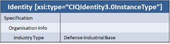
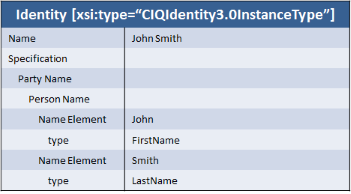

The STIX [Identity](/data-model/{{site.current_version}}/stixCommon/IdentityType) construct is used throughout the language to characterize identity information for people and organizations. More specifically, it is used:

* To specify the identity of the source of STIX content (via [InformationSourceType](/data-model/{{site.current_version}}/stixCommon/InformationSourceType))
* To describe identifying characteristics or specific identities of victims of an incident (via [IncidentType](/data-model/{{site.current_version}}/incident/IncidentType))
* To describe identifying characteristics of those targeted by a specific adversary (via [TTPType](/data-model/{{site.current_version}}/ttp/TTPType) [VictimTargetingType](/data-model/{{site.current_version}}/ttp/VictimTargetingType))
* To describe identifying characteristics or specific identities of threat actors (via [ThreatActorType](/data-model/{{site.current_version}}/ta/ThreatActorType))

Across all of these usages you'll notice that there are two primary types of identities: those that describe specific identities (usually names), and those that simply give identifying characteristics (nationality, language, etc.).

STIX identity is an [xsi:type extension point](/documentation/concepts/xsi-type). The base [IdentityType](/data-model/{{site.current_version}}/stixCommon/IdentityType) can be used to express simple names and the default extension [CIQ Identity Type](/data-model/{{site.current_version}}/stixCiq/STIXCiqIdentity3.0InstanceType) allows you to specify extensive information via the use of OASIS CIQ.

## Which should I support?

When representing identity information the first decision to make is whether to support the base [IdentityType](/data-model/{{site.current_version}}/stixCommon/IdentityType) or the more flexible (but also more complex) [CIQ Identity Type](/data-model/{{site.current_version}}/stixCiq/STIXCiqIdentity3.0InstanceType).

### As a producer

The following guidelines will help:

1. First, determine if you're complying with a profile that makes the decision for you. Some profiles will only allow the basic type while others will allow both or only the richer CIQ type.
2. If the profile doesn't help decide, consider whether your data will now and forever only consist of a name. If so, use just the Name field in IdentityType. This case is most common when identifying the source of information of STIX constructs: often you'll just want to specify your organization's name as the source.
3. If you have name information but also other data (address, nationality, etc.) that you want to express then you should use BOTH the name field in IdentityType as well as the CIQ fields. This may mean duplicating some information, but it will allow less full-featured consumers to see the name while those that understand the CIQ extension can use that.
4. If you don't have name information and only have other identifying data, then the only option is to characterize it using CIQ.

### As a consumer

When considering whether to support the basic IdentityType or the CIQ extension or both, consider the following guidelines:

1. First, determine if you're complying with a profile that makes the decision for you. Some profiles will only allow the basic type while others will allow both or only the richer CIQ type.
2. Always support the basic `Name` field in IdentityType. Less full-featured producers may only be able to supply a simple name.
3. Consider whether your application is enhanced by having more in-depth identity information. If so, consider supporting CIQ. Also note that not all producers will follow the above guidelines and so you might at times not have the `Name` field in IdentityType even though its populated in the CIQ structure. You should make a particular effort to support CIQ for the usages of Identity other than in InformationSourceType.
4. Consider whether you need to support all of CIQ. If your application will never care about nationality data, don't support that field. For these descriptive fields it's probably better to just ignore the fields you don't want to support rather than throw an error, that way you'll be able to consume content from producers that do populate the fields.

## Where do I put _____ in CIQ?

When using the full CIQ Identity structure it can often be confusing to figure out where specific information should go and the CIQ documentation is not easy to find or use. To make it easier, the table below explains where to put commonly used identity information into CIQ.

<table class="table table-condensed table-striped">
  <thead>
    <tr>
      <th></th>
      <th>XPath</th>
      <th>Python API Object Model</th>
    </tr>
  </thead>
  <tbody>
    <tr>
      <td>Person Name</td>
      <td>xpil:PartyName/xnl:PersonName[@xnl:Type=""]/xnl:NameElement</td>
      <td>specification.party_name.name_element[][type|value]</td>
    </tr>
    <tr>
      <td>Organization Name</td>
      <td>xpil:PartyName/xnl:OrganisationName[@xnl:Type=""]/xnl:NameElement</td>
      <td>specification.party_name.name_element[].[type|value]</td>
    </tr>
    <tr>
      <td>Industry Sector</td>
      <td>xpil:OrganisationInfo/@xpil:IndustryType (comma separated)</td>
      <td>specification.organisation_info.industry_type (comma separated)</td>
    </tr>
    <tr>
      <td>Nationality</td>
      <td>xpil:Nationalities/xpil:Country/xal:NameElement</td>
      <td>Not supported</td>
    </tr>
    <tr>
      <td>Languages</td>
      <td>xpil:Languages/xpil:Language/xal:NameElement</td>
      <td>specification.languages[].value[].[type|value]</td>
    </tr>
    <tr>
      <td>Address</td>
      <td>xpil:Addresses/xpil:Address (various elements)</td>
      <td>specification.addresses[]</td>
    </tr>
    <tr>
      <td>Email Address</td>
      <td>xpil:ElectronicAddressIdentifiers/xpil:ElectronicAddressIdentifier[@xpil:Type="Email"]</td>
      <td>specification.electronic_address_identifiers[].[type="Email"|value]</td>
    </tr>
    <tr>
      <td>Chat Handle</td>
      <td>xpil:ElectronicAddressIdentifiers/xpil:ElectronicAddressIdentifier[@xpil:Type=""]</td>
      <td>specification.electronic_address_identifiers[].[type|value]</td>
    </tr>
    <tr>
      <td>Phone</td>
      <td>xpil:ContactNumbers/xpil:ContactNumber[@xpil:CommunicationMediaType="Telephone"]/xpil:ContactNumberElement[@xpil:Type=""]</td>
      <td>specification.contact_numbers[].contact_number_elements[].value</td>
    </tr>
  </tbody>
</table>

## What does it look like?

<strong>Warning! </strong>Due to a bug (<a href="https://github.com/STIXProject/python-stix/issues/187">#187</a>) in the python-stix API, the code samples below do not generate best-practice compliant content as of v1.1.1.1 for organization and person names.

Given the above guidelines, it's likely that STIX identity information will fall into one of three situations: only the base IdentityType, only the CIQ identity, and both.

### Using only STIX IdentityType

  <ul class="nav nav-tabs">
    <li class="active"><a href="#header-identity-diagram" data-toggle="tab">Diagram</a></li>
    <li><a href="#header-identity-xml" data-toggle="tab">XML</a></li>
    <li><a href="#header-identity-produce" data-toggle="tab">Production Python</a></li>
    <li><a href="#header-identity-consume" data-toggle="tab">Consumption Python</a></li>
  </ul>
  

    

      
    

    

  
  <stixCommon:Identity>
    <stixCommon:Name>John Smith</stixCommon:Name>
  </stixCommon:Identity>
  
    

    

  
  from stix.common import Identity

  identity = Identity()
  identity.name = "John Smith"
  
    

    

  
  print identity.name # "John Smith"
  
    

  

### Using only CIQ

  <ul class="nav nav-tabs">
    <li class="active"><a href="#header-ciq-diagram" data-toggle="tab">Diagram</a></li>
    <li><a href="#header-ciq-xml" data-toggle="tab">XML</a></li>
    <li><a href="#header-ciq-produce" data-toggle="tab">Production Python</a></li>
    <li><a href="#header-ciq-consume" data-toggle="tab">Consumption Python</a></li>
  </ul>
  

    

      
    

    

  
  <stixCommon:Identity xsi:type="stixCIQIdentity:CIQIdentity3.0InstanceType">
    <stixCIQIdentity:Specification>
      <xpil:OrganisationInfo xpil:IndustryType="Defense Industrial Base"/>
    </stixCIQIdentity:Specification>
  </stixCommon:Identity>
  
    

    

  
  from stix.extensions.identity.ciq_identity_3_0 import (CIQIdentity3_0Instance, STIXCIQIdentity3_0, OrganisationInfo)

  ciq_identity = CIQIdentity3_0Instance()
  identity_spec = STIXCIQIdentity3_0()
  identity_spec.organisation_info = OrganisationInfo(industry_type="Defense Industrial Base")
  ciq_identity.specification = identity_spec
  
    

    

  
  print identity.specification.organisation_info.industry_type # Defense Industrial Base
  
    

  

  
  
<strong>Don't do this!</strong> As noted above, don't use the name fields in CIQ without also setting the name in the base STIX IdentityType. It means that consumers who only understand the base field are unable to process the content even though it contains data that they should be able to handle if it were represented differently. Duplicating information into the base IdentityType Name field allows less full-featured consumers to also get value out of the data.

   

### Using both IdentityType and CIQ

  <ul class="nav nav-tabs">
    <li class="active"><a href="#header-both-diagram" data-toggle="tab">Diagram</a></li>
    <li><a href="#header-both-xml" data-toggle="tab">XML</a></li>
    <li><a href="#header-both-produce" data-toggle="tab">Production Python</a></li>
    <li><a href="#header-both-consume" data-toggle="tab">Consumption Python</a></li>
  </ul>
  

    

      
    

    

  
  <stixCommon:Identity xsi:type="stixCIQIdentity:CIQIdentity3.0InstanceType">
    <stixCommon:Name>John Smith</stixCommon:Name>
    <stixCiqIdentity:Specification>
      <xpil:PartyName>
        <xnl:PersonName>
          <xnl:NameElement xnl:ElementType="FirstName">John</xnl:NameElement>
          <xnl:NameElement xnl:ElementType="LastName">Smith</xnl:NameElement>
        </xnl:PersonName>
      </xpil:PartyName>
    </stixCiqIdentity:Specification>
  </stixCommon:Identity>
  
    

    

  
  from stix.extensions.identity.ciq_identity_3_0 import (CIQIdentity3_0Instance, STIXCIQIdentity3_0, PartyName, NameLine)

  party_name = PartyName()
  first_name = NameLine()
  first_name.value = "John"
  first_name.type = "FirstName"
  last_name = NameLine()
  last_name.value = "Smith"
  last_name.type = "LastName"
  party_name.add_name_line(first_name)
  party_name.add_name_line(last_name)

  identity = CIQIdentity3_0Instance()
  identity_spec = STIXCIQIdentity3_0()
  identity_spec.party_name = party_name
  identity.name = "John Smith"
  identity.specification = identity_spec
  
    

    

  
  for name_line in identity.specification.party_name.name_lines:
    print name_line.type # LastName or FirstName
    print name_line.value # John or Smith

  # Or, simpler consumers may do
  print identity.name # John Smith
  
    

  

