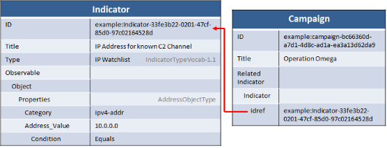
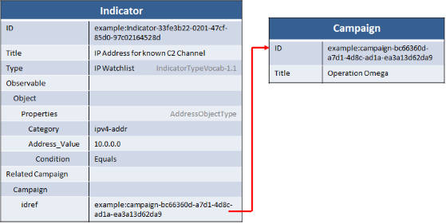

One of the relationships supported by the STIX data model is the relationship between campaigns and indicators. It allows for indicators to be directly linked to any campaigns of activity that the indicator is considered to be a member of. This allows network defenders to better understand the pattern of behavior behind detected attacks and link it to other related data (victim targeting, previous incidents, attributed threat actors, etc.)

Prior to STIX 1.1, the Campaign structure contained relationships to Indicators.  In STIX 1.1, the directionality of this relationship was changed so that Indicators could now contain relationships to Campaigns; furthermore the "old" style Campaign to Indicator relationship construct was deprecated.  Because this was done in a minor release, however, the "old" style still exists in the data model even though it has been deprecated.  Support for the "old" style will be removed in the next major release of STIX.

## Deprecated, Old-Style Approach (Campaign => Indicator)

The old-style approach, which was used in pre-1.1 versions of STIX, captures the Indicator<=>Campaign relationship on the Campaign construct. The list of indicators that might indicate the campaign are included either as references or directly embedded within the campaign.

During the 1.1 release the community determined that this approach had several major weaknesses:

  * It requires versioning updates to campaigns each time an indicator related to that campaign is created, modified, or revoked. Because indicators get created so frequently, this creates a lot of churn in the campaign.
  * The relationship is more semantically correct when seen via the other direction. The campaign is what it is without the campaign while the campaign relationship on indicator captures one of the key components of an indicator (what it means when I see this).

Because this was done as a minor release, however, the previous capability remains in the schema. Its use is permitted but discouraged by the specification.


  

<stix:Indicators>
    <stix:Indicator id="example:indicator-c43a0a05-e8d2-4f64-ae37-3f3fb153f8d9" timestamp="2014-09-09T19:58:39.608000+00:00" xsi:type='indicator:IndicatorType' negate="false" version="2.1.1">
        <indicator:Title>IP Address for known C2 Channel</indicator:Title>
        <indicator:Type xsi:type="stixVocabs:IndicatorTypeVocab-1.1">IP Watchlist</indicator:Type>
        <indicator:Observable id="example:Observable-f1712715-9bcd-404a-bf47-76504cf1232c">
            <cybox:Object id="example:Address-c4d21d91-2bea-4b19-ac53-c513f1b1bc51">
                <cybox:Properties xsi:type="AddressObj:AddressObjectType" category="ipv4-addr">
                    <AddressObj:Address_Value condition="Equals">10.0.0.0</AddressObj:Address_Value>
                </cybox:Properties>
            </cybox:Object>
        </indicator:Observable>
    </stix:Indicator>
</stix:Indicators>
<stix:Campaigns>
    <stix:Campaign id="example:Campaign-b549a58c-afd9-4847-85c3-5be13d56d3cc" timestamp="2014-09-09T19:58:39.609000+00:00" xsi:type='campaign:CampaignType' version="1.1.1">
      <campaign:Title>Operation Omega</campaign:Title>
        <campaign:Related_Indicators>
            <campaign:Related_Indicator>
                <stixCommon:Indicator idref="example:indicator-c43a0a05-e8d2-4f64-ae37-3f3fb153f8d9" xsi:type='indicator:IndicatorType' negate="false" version="2.1.1"/>
            </campaign:Related_Indicator>
        </campaign:Related_Indicators>
    </stix:Campaign>
</stix:Campaigns>

package = STIXPackage()

# Create the indicator
indicator = Indicator(title="IP Address for known C2 Channel")
indicator.add_indicator_type("IP Watchlist")
address = Address(category="ipv4-addr")
address.address_value = "10.0.0.0"
address.address_value.condition = "Equals"
indicator.observable = address
package.add_indicator(indicator)

# Create the campaign
campaign = Campaign(title="Operation Omega")
package.add_campaign(campaign)

# Link the campaign to the indicator
campaign.related_indicators.append(RelatedIndicator(item=Indicator(idref=indicator.id_)))



# Collect indicators by ID
indicators = {}
for indicator in pkg.indicators:
  indicators[indicator.id_] = indicator

# Walk all campaigns
for campaign in pkg.campaigns:
  print "Campaign: " + campaign.title
  # And list relationships to indicators
  for indicator in campaign.related_indicators:
    print "  - Related To: " + indicators[indicator.item.idref].title


<h2>New Style (Indicator => Campaign)</h2>

The new structure is similar to the old one, with two exceptions:

<ol>
  <li>It goes in the other direction, so indicators point to campaigns rather than the other way around.</li>
  <li>It only allows for references (via @idref) to campaigns.</li>
</ol>

This new approach is encouraged for all versions of STIX in which it is valid (1.1 and beyond).


**Warning!** The current version of python-stix (v1.1.1.1) does not support this structure. This is tracked via issue [#192](https://github.com/STIXProject/python-stix/issues/192)



  


<stix:Indicators>
    <stix:Indicator id="example:indicator-c43a0a05-e8d2-4f64-ae37-3f3fb153f8d9" timestamp="2014-09-09T19:58:39.608000+00:00" xsi:type='indicator:IndicatorType' negate="false" version="2.1.1">
        <indicator:Title>IP Address for known C2 Channel</indicator:Title>
        <indicator:Type xsi:type="stixVocabs:IndicatorTypeVocab-1.1">IP Watchlist</indicator:Type>
        <indicator:Observable id="example:Observable-f1712715-9bcd-404a-bf47-76504cf1232c">
            <cybox:Object id="example:Address-c4d21d91-2bea-4b19-ac53-c513f1b1bc51">
                <cybox:Properties xsi:type="AddressObj:AddressObjectType" category="ipv4-addr">
                    <AddressObj:Address_Value condition="Equals">10.0.0.0</AddressObj:Address_Value>
                </cybox:Properties>
            </cybox:Object>
        </indicator:Observable>
        <indicator:Related_Campaigns>
            <indicator:Related_Campaign>
                <stixCommon:Campaign idref="example:Campaign-b549a58c-afd9-4847-85c3-5be13d56d3cc" timestamp="2014-09-09T19:58:39.609000+00:00" />
            </indicator:Related_Campaign>
        </indicator:Related_Campaigns>
    </stix:Indicator>
</stix:Indicators>
<stix:Campaigns>
    <stix:Campaign id="example:Campaign-b549a58c-afd9-4847-85c3-5be13d56d3cc" timestamp="2014-09-09T19:58:39.609000+00:00" xsi:type='campaign:CampaignType' version="1.1.1">
        <campaign:Title>Operation Omega</campaign:Title>
    </stix:Campaign>
</stix:Campaigns>



package = STIXPackage()

# Create the indicator
indicator = Indicator(title="IP Address for known C2 Channel")
indicator.add_indicator_type("IP Watchlist")
address = Address(category="ipv4-addr")
address.address_value = "10.0.0.0"
address.address_value.condition = "Equals"
indicator.observable = address
package.add_indicator(indicator)

# Create the campaign
campaign = Campaign(title="Operation Omega")
package.add_campaign(campaign)

# Link the indicator to the campaign
# TODO: Broken, see #192
# indicator.related_campaigns.append(RelatedCampaign(item=Campaign(idref=campaign.id_)))



# Collect campaigns by ID
campaigns = {}
for campaign in pkg.campaigns:
  campaigns[campaign.id_] = campaign

# Walk all campaigns
for indicator in pkg.indicators:
  print "Indicator: " + indicator.title
  # And list relationships to campaigns
  # Broken, see #192
  # for campaign in indicator.related_campaigns:
  #   print "  - Related To: " + campaigns[campaign.item.idref].title



## Do I need to support the old capability?

### Producers

**No**, unless the profile you're conforming to requires it or you've heard from consumers that you interface with that they need it. In particular, you should **not** duplicate data using both approaches: if you use the new approach, do not use the old approach and vice-versa.

Producers who already support the old approach are still considered compliant with the specification.

### Consumers

**Maybe**, if allowed by your profile or if any of your producers are creating it. It's possible that you will need to support both: the new approach for those that support it and the old approach for those that do not. When doing this, it can be tempting to convert the old-style relationships to the new style.

## How do I convert old-style to new-style?

### Converting your own content

If you own and control the content then it can safely be convered to the new format. The following steps roughly indicate how to do so, though the specifics may vary depending on your data store and whether you have consumers to notify.

1. If any indicators were embedded in the campaign, make them top-level constructs.
2. Remove the existing relationships, reverse the direction, and add them to Indicator.
  * Remember to also reverse the direction of any relationship description that you used.
3. Issue any updates to both the indicator and the campaign as appropriate to ensure your consumers have the latest version.

### Converting other content

Be very careful when converting content that you do not control to the new style. Updates to that content by the producer could interfere with your changes and, if at some point the producer does convert, you may end up in an inconsistent state with what they're producing.

## Summary

* Do not use "old-style" Campaign=>Indicator relationships for new content
* Consumers may need to support the old style
* You can convert your own content to consistently use the new style, but should be careful converting content you don't own or control
