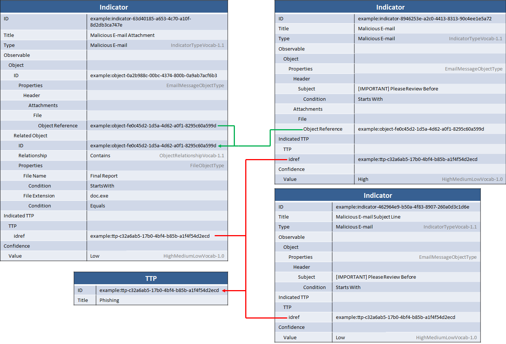

Given that phishing is such a common attack vector, the ability to represent indicators for malicious e-mail is critical. In particular, indicators must be able to represent information about the e-mail itself (subject, sender, header information, etc.) as well as any attachments or links. This idiom describes representing a set of indicators for a malicious e-mail that has one attachment.

## Scenario

This scenario consists of several related indicators used to represent a malicious e-mail. The e-mail has a somewhat unique subject pattern (it always starts with "[IMPORTANT] Please Review Before" and is followed by a date in the near future) asking for a document to be reviewed but has a random sender. It includes an attachment to a file with the extension ".doc.exe", but the actual file is somewhat variable so no consistent hash could be identified. It is desired to enable detection of this complete multi-part pattern or either of its partial patterns.

## Data model

The data model for this idiom is fairly complicated because the set of matchable patterns is varied: an e-mail could come in that matches the subject but ends in ".ppt.exe" instead of ".doc.exe", or it might come in and match ".doc.exe" but not match the subject pattern, or it might match both. To represent this in the data, three indicators are used: one indicator for the e-mail subject pattern with low confidence, one indicator for the attachment pattern with low confidence, and one indicator with both the subject pattern and the attachment with a high confidence. That way if only one fact or the other matches it's clearer that the match may be less accurate, while a match of both is more accurate.

Finally, a very simple indicated TTP is present in order to indicate that if either the full e-mail indicator or either individual indicator matches it indicates a potential phishing attempt.

Yes, this diagram is fairly complicated. It's easiest to understand if you take a look at each object and its relationships separately.

### E-mail Subject Indicator

The e-mail subject indicator, in the bottom-right, matches just the e-mail subject line. It has a `Title` and a `Type` (using the [IndicatorTypeVocab-1.1](/data-model/{{site.current_version}}/stixVocabs/IndicatorTypeVocab-1.0) vocabulary) to give it some basic identifying information meant for humans. The "test" portion of the indicator consists of an [Observable](/data-model/{{site.current_version}}/cybox/ObservableType) with an [Email Message Object](/data-model/{{site.current_version}}/EmailMessageObj/EmailMessageObjectType). The pattern for the subject is that it always starts with the same text, so the field value for e-mail `Subject` field (inside the `Header`) is set to "[IMPORTANT] Please Review Before" and the CybOX `Condition` field is set to "Starts With" to indicate that the pattern should match if an e-mail is matched against it whose subject line starts with that text.

The indicated TTP for the indicator gives the indicator some context (relationship line in red). In this case, it says that if you see something that matches the pattern it indicates that you could have a phishing attack. In order to focus on the indicator portion of the data model for this idiom, the TTP was left purposefully vague but could easily be filled in with the more advanced [TTP idioms](../#ttp).

Finally, the `Confidence` field is used to indicate that this indicator is "Low" confidence (using the default vocabulary in STIX for confidence, [HighMediumLowVocab-1.0](/data-model/{{site.current_version}}/stixVocabs/HighMediumLowVocab-1.0)).

### E-mail Attachment Indicator

The indicator for the attachment, in the top-left, has a somewhat more complicated structure. In CybOX, attachments to an e-mail are represented via the `Attachments` field by using an `object reference` to the ID of the attached object (generally a [FileObject](/data-model/{{site.current_version}}/FileObj/FileObjectType)) defined elsewhere. In this case, the attachment is indeed represented as a FileObject and is defined as a `Related Object` on the e-mail message object. The `Relationship` descriptor uses [ObjectRelationshipVocab-1.1](/data-model/{{site.current_version}}/cyboxVocabs/ObjectRelationshipVocab-1.1) (the default vocabulary for this field) to describe that the e-mail "Contains" the file.

That's a fairly complicated structure but is repeatable as a pattern throughout CybOX when one object (in this case a File) is contained in another object (in this case an e-mail). It ensures that each object is representable as an IDable construct on its own but still allows you to represent the full semantics of how one object is embedded in another.

The indicated TTP and Confidence structures are identical to the e-mail subject indicator as explained above.

### Combined Indicator

The combined indicator essentially takes both data points (e-mail subject and attachment) from the previous two indicators and combines them. The e-mail subject is completely duplicated, but because the file object for the attachment is already defined the combined indicator simply references it. This reduces the size of the XML and, more importantly, correctly represents that the two indicators are talking about the exact same attachment.

The indicated TTP is the same as the previous indicators, while confidence is represented the same but is set to "High" for this combined indicator because a match against both subject and attachment is more likely to be accurate than a match against one or the other.

## Implementation


<stix:Indicators>
    <stix:Indicator id="example:indicator-5cc558cc-b8fc-11e3-9a15-0800271e87d2" timestamp="2014-03-31T13:46:17.895653" xsi:type='indicator:IndicatorType'>
        <indicator:Title>Malicious E-mail</indicator:Title>
        <indicator:Type xsi:type="stixVocabs:IndicatorTypeVocab-1.0">Malicious E-mail</indicator:Type>
        <indicator:Observable id="example:Observable-1037c602-9e1c-43fd-8d07-c8e1d01466d1">
            <cybox:Object id="example:EmailMessage-977c4bb1-0a5d-4c36-9bd7-99b5c2082fdd">
                <cybox:Properties xsi:type="EmailMessageObj:EmailMessageObjectType">
                    <EmailMessageObj:Header>
                        <EmailMessageObj:Subject condition="StartsWith">[IMPORTANT] Please Review Before</EmailMessageObj:Subject>
                    </EmailMessageObj:Header>
                    <EmailMessageObj:Attachments>
                        <EmailMessageObj:File object_reference="example:EmailMessage-6c5185d4-dfca-46b5-8c15-adcfb464bf99"/>
                    </EmailMessageObj:Attachments>
                </cybox:Properties>
            </cybox:Object>
        </indicator:Observable>
        <indicator:Indicated_TTP>
            <stixCommon:TTP idref="example:ttp-5cc396ea-b8fc-11e3-9a15-0800271e87d2" />
        </indicator:Indicated_TTP>
        <indicator:Confidence timestamp="2014-03-31T13:46:17.895959">
            <stixCommon:Value xsi:type="stixVocabs:HighMediumLowVocab-1.0">High</stixCommon:Value>
        </indicator:Confidence>
    </stix:Indicator>
    <stix:Indicator id="example:indicator-5cc41142-b8fc-11e3-9a15-0800271e87d2" timestamp="2014-03-31T13:46:17.887364" xsi:type='indicator:IndicatorType'>
        <indicator:Title>Malicious E-mail Subject Line</indicator:Title>
        <indicator:Type xsi:type="stixVocabs:IndicatorTypeVocab-1.0">Malicious E-mail</indicator:Type>
        <indicator:Observable id="example:Observable-6964f5ca-3705-4ebf-9cd5-79ac6244df57">
            <cybox:Object id="example:EmailMessage-f154f5a8-d302-430a-acd5-48f87c6a2119">
                <cybox:Properties xsi:type="EmailMessageObj:EmailMessageObjectType">
                    <EmailMessageObj:Header>
                        <EmailMessageObj:Subject condition="StartsWith">[IMPORTANT] Please Review Before</EmailMessageObj:Subject>
                    </EmailMessageObj:Header>
                </cybox:Properties>
            </cybox:Object>
        </indicator:Observable>
        <indicator:Indicated_TTP>
            <stixCommon:TTP idref="example:ttp-5cc396ea-b8fc-11e3-9a15-0800271e87d2" />
        </indicator:Indicated_TTP>
        <indicator:Confidence timestamp="2014-03-31T13:46:17.888834">
            <stixCommon:Value xsi:type="stixVocabs:HighMediumLowVocab-1.0">Low</stixCommon:Value>
        </indicator:Confidence>
    </stix:Indicator>
    <stix:Indicator id="example:indicator-5cc4cd76-b8fc-11e3-9a15-0800271e87d2" timestamp="2014-03-31T13:46:17.892160" xsi:type='indicator:IndicatorType'>
        <indicator:Title>Malicious E-mail Attachment</indicator:Title>
        <indicator:Type xsi:type="stixVocabs:IndicatorTypeVocab-1.0">Malicious E-mail</indicator:Type>
        <indicator:Observable id="example:Observable-484190c0-efdc-49a6-aa19-aa2cb784aacf">
            <cybox:Object id="example:EmailMessage-6c5185d4-dfca-46b5-8c15-adcfb464bf99">
                <cybox:Properties xsi:type="EmailMessageObj:EmailMessageObjectType">
                    <EmailMessageObj:Attachments>
                        <EmailMessageObj:File object_reference="example:EmailMessage-6c5185d4-dfca-46b5-8c15-adcfb464bf99"/>
                    </EmailMessageObj:Attachments>
                </cybox:Properties>
                <cybox:Related_Objects>
                    <cybox:Related_Object id="example:File-4e98a690-408a-4ed8-a7ba-3564a2dfb3fd">
                        <cybox:Properties xsi:type="FileObj:FileObjectType">
                            <FileObj:File_Name condition="StartsWith">Final Report</FileObj:File_Name>
                            <FileObj:File_Extension condition="Equals">doc.exe</FileObj:File_Extension>
                        </cybox:Properties>
                        <cybox:Relationship xsi:type="cyboxVocabs:ObjectRelationshipVocab-1.0">Contains</cybox:Relationship>
                    </cybox:Related_Object>
                </cybox:Related_Objects>
            </cybox:Object>
        </indicator:Observable>
        <indicator:Indicated_TTP>
            <stixCommon:TTP idref="example:ttp-5cc396ea-b8fc-11e3-9a15-0800271e87d2" />
        </indicator:Indicated_TTP>
        <indicator:Confidence timestamp="2014-03-31T13:46:17.892662">
            <stixCommon:Value xsi:type="stixVocabs:HighMediumLowVocab-1.0">Low</stixCommon:Value>
        </indicator:Confidence>
    </stix:Indicator>
</stix:Indicators>
<stix:TTPs>
    <stix:TTP id="example:ttp-5cc396ea-b8fc-11e3-9a15-0800271e87d2" timestamp="2014-03-31T13:46:17.884031" xsi:type='ttp:TTPType' version="1.1">
        <ttp:Title>Phishing</ttp:Title>
    </stix:TTP>
</stix:TTPs>

stix_package = STIXPackage()
ttp = TTP(title="Phishing")
stix_package.add_ttp(ttp)

# Create the indicator for just the subject
email_subject_object = EmailMessage()
email_subject_object.header = EmailHeader()
email_subject_object.header.subject = "[IMPORTANT] Please Review Before"
email_subject_object.header.subject.condition = "StartsWith"

email_subject_indicator = Indicator()
email_subject_indicator.title = "Malicious E-mail Subject Line"
email_subject_indicator.add_indicator_type("Malicious E-mail")
email_subject_indicator.observable = email_subject_object
email_subject_indicator.confidence = "Low"

# Create the indicator for just the attachment

file_attachment_object = EmailMessage()
file_attachment_object.attachments = Attachments()

attached_file_object = File()
attached_file_object.file_name = "Final Report"
attached_file_object.file_name.condition = "StartsWith"
attached_file_object.file_extension = "doc.exe"
attached_file_object.file_extension.condition = "Equals"

file_attachment_object.add_related(attached_file_object, "Contains", inline=True)
file_attachment_object.attachments.append(file_attachment_object.parent.id_)

indicator_attachment = Indicator()
indicator_attachment.title = "Malicious E-mail Attachment"
indicator_attachment.add_indicator_type("Malicious E-mail")
indicator_attachment.observable = file_attachment_object
indicator_attachment.confidence = "Low"

# Create the combined indicator w/ both subject an attachment
full_email_object = EmailMessage()
full_email_object.attachments = Attachments()

# Add the previously referenced file as another reference rather than define it again:
full_email_object.attachments.append(file_attachment_object.parent.id_)

full_email_object.header = EmailHeader()
full_email_object.header.subject = "[IMPORTANT] Please Review Before"
full_email_object.header.subject.condition = "StartsWith"

combined_indicator = Indicator(title="Malicious E-mail")
combined_indicator.add_indicator_type("Malicious E-mail")
combined_indicator.confidence = Confidence(value="High")
combined_indicator.observable = full_email_object

email_subject_indicator.add_indicated_ttp(TTP(idref=ttp.id_))
indicator_attachment.add_indicated_ttp(TTP(idref=ttp.id_))
combined_indicator.add_indicated_ttp(TTP(idref=ttp.id_))

stix_package.indicators = [combined_indicator, email_subject_indicator, indicator_attachment]
print stix_package.to_xml()

ttp_list = {}
for thing in pkg.ttps:
    ttp_list[thing.id_] = thing.title

print "== EMAIL =="
for ind in pkg.indicators:
    print "---"
    print "Title : " + ind.title
    print "ID : " + ind.id_
    for ind_type in ind.indicator_types:
        print "Type: " + str(ind_type)
        
    print "Confidence: " + str(ind.confidence.value)
    
    # look up ttp from list in package
    for ref_ttp in ind.indicated_ttps:
        print "TTP: " + ttp_list[ref_ttp.item.idref]
    
    for obs in ind.observables:
        if obs.object_.related_objects:
            #  attachment is inline
            print "Attachment ID: " + str(obs.object_.id_)
            print "Attachment Filename: " + str(obs.object_.related_objects[0].properties.file_name)
            print "Attachment File extension: " + str(obs.object_.related_objects[0].properties.file_extension)
            print "Relationship: " + str(obs.object_.related_objects[0].relationship)
        elif obs.object_.properties.header:
            print "Subject : " + str(obs.object_.properties.header.subject)
            if obs.object_.properties.attachments:
                print "Attachment -> : " + str(obs.object_.properties.attachments[0].object_reference)



[Full XML](malicious-email-indicator-with-attachment.xml) | [Python Producer](malicious-email-indicator-with-attachment_producer.py) | [Python Consumer](malicious-email-indicator-with-attachment_consumer.py)

## Further Reading

* [Indicator Type](/data-model/{{site.current_version}}/indicator/IndicatorType)
* [CybOX File Object](/data-model/{{site.current_version}}/FileObj/FileObjectType)
