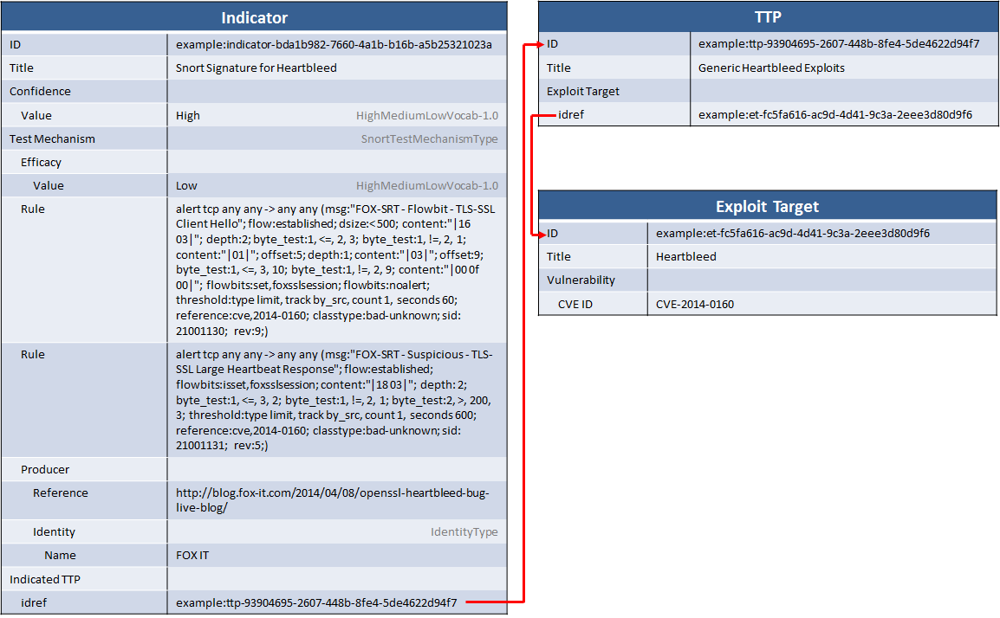

While one option when sharing indicator signatures is to use the tool-neutral `Observable` field in the indicator using CybOX, another option is to take a tool-specific approach and share indicators with signatures in the native language of specific tools via the `Test_Mechanisms` field. The advantage of this is that you can share signatures that work natively in existing tools but can still integrate with the rest of the STIX architecture.

This idiom describes using the Snort test mechanism to share a set of Snort signatures for the Heartbleed vulnerability that were [posted by FOX IT](http://blog.fox-it.com/2014/04/08/openssl-heartbleed-bug-live-blog/).

## Scenario

The producer of this information wanted to quickly dissemnate information that a wide variety of organizations could easily implement so they chose to share Snort signatures. They provided two sets of signatures: one had a higher false-positive rate but would be more likely to detect exploit attempts while the other had a lower false-positive rate but would be less likely to detect exploit attempts. This idiom describes representing the latter set.

## Data Model

The information that the producer provided was that the Snort signatures detected exploits of the Heartbleed vulnerability (CVE-2014-0160). In STIX, this is represented by a set of three objects:

* An [Indicator](/data-model/{{site.current_version}}/indicator/IndicatorType) is used to encode the Snort signatures themselves
* The indicator is related to an indicated [TTP](/data-model/{{site.current_version}}/ttp/TTPType) that simply states the TTP is for exploits of Heartbleed
* The TTP is related to an [Exploit Target](/data-model/{{site.current_version}}/et/ExploitTargetType) describing the [CVE](../cve)

This structure allows for pivoting and information expression at each conceptual level: signature, exploit, and vulnerability. The diagram looks like this:

There are a few other details to note as well:

* Because the producer noted that the indicator has a low rate of false positives, the `Confidence` on the indicator is set to High. This indicates that if the indicator "triggers", it's likely that the indicated TTP has been discovered.
* Because the producer also noted that the indicator has a lower detection rate, the `Efficacy` on the Test Mechanism is set to Low. This indicates that the indicator is not likely to catch all cases of the indicated TTP.
* The `Producer` field is set to provide a reference back to the original information source (blog entry) from FOX IT.
* The rules themselves are wrapped in CDATA to ensure that any tags or things like that won't break the XML structure and don't need to be escaped.

## Implementation


<stix:Indicator id="example:indicator-567b201c-4fd5-4bde-a5db-42abc340807a" timestamp="2014-06-20T15:16:56.987616+00:00" xsi:type='indicator:IndicatorType' negate="false" version="2.1.1">
    <indicator:Title>Snort Signature for Heartbleed</indicator:Title>
    <indicator:Indicated_TTP>
        <stixCommon:TTP idref="example:ttp-8c12783d-3ebd-42bd-8dcd-e81dab56a47a" xsi:type='ttp:TTPType' version="1.2"/>
    </indicator:Indicated_TTP>
    <indicator:Test_Mechanisms>
        <indicator:Test_Mechanism id="example:testmechanism-a1475567-50f7-4dae-b0d0-47c7ea8e79e1" xmlns:snortTM='http://stix.mitre.org/extensions/TestMechanism#Snort-1' xsi:type='snortTM:SnortTestMechanismType'>
            <indicator:Efficacy timestamp="2014-06-20T15:16:56.987966+00:00">
                <stixCommon:Value xsi:type="stixVocabs:HighMediumLowVocab-1.0">Low</stixCommon:Value>
            </indicator:Efficacy>
            <indicator:Producer>
                <stixCommon:Identity id="example:Identity-a0740d84-9fcd-44af-9033-94e76a53201e">
                    <stixCommon:Name>FOX IT</stixCommon:Name>
                </stixCommon:Identity>
                <stixCommon:References>
                    <stixCommon:Reference>http://blog.fox-it.com/2014/04/08/openssl-heartbleed-bug-live-blog/</stixCommon:Reference>
                </stixCommon:References>
            </indicator:Producer>
            <snortTM:Rule><![CDATA[alert tcp any any -> any any (msg:"FOX-SRT - Flowbit - TLS-SSL Client Hello"; flow:established; dsize:< 500; content:"|16 03|"; depth:2; byte_test:1, <=, 2, 3; byte_test:1, !=, 2, 1; content:"|01|"; offset:5; depth:1; content:"|03|"; offset:9; byte_test:1, <=, 3, 10; byte_test:1, !=, 2, 9; content:"|00 0f 00|"; flowbits:set,foxsslsession; flowbits:noalert; threshold:type limit, track by_src, count 1, seconds 60; reference:cve,2014-0160; classtype:bad-unknown; sid: 21001130; rev:9;)]]></snortTM:Rule>
            <snortTM:Rule><![CDATA[alert tcp any any -> any any (msg:"FOX-SRT - Suspicious - TLS-SSL Large Heartbeat Response"; flow:established; flowbits:isset,foxsslsession; content:"|18 03|"; depth: 2; byte_test:1, <=, 3, 2; byte_test:1, !=, 2, 1; byte_test:2, >, 200, 3; threshold:type limit, track by_src, count 1, seconds 600; reference:cve,2014-0160; classtype:bad-unknown; sid: 21001131; rev:5;)]]></snortTM:Rule>
        </indicator:Test_Mechanism>
    </indicator:Test_Mechanisms>
    <indicator:Confidence timestamp="2014-06-20T15:16:56.987649+00:00">
        <stixCommon:Value xsi:type="stixVocabs:HighMediumLowVocab-1.0">High</stixCommon:Value>
    </indicator:Confidence>
</stix:Indicator>

indicator = Indicator(title = "Snort Signature for Heartbleed")
indicator.confidence = Confidence("High")

tm = SnortTestMechanism()
tm.rules = [
    """alert tcp any any -> any any (msg:"FOX-SRT - Flowbit - TLS-SSL Client Hello"; flow:established; dsize:< 500; content:"|16 03|"; depth:2; byte_test:1, <=, 2, 3; byte_test:1, !=, 2, 1; content:"|01|"; offset:5; depth:1; content:"|03|"; offset:9; byte_test:1, <=, 3, 10; byte_test:1, !=, 2, 9; content:"|00 0f 00|"; flowbits:set,foxsslsession; flowbits:noalert; threshold:type limit, track by_src, count 1, seconds 60; reference:cve,2014-0160; classtype:bad-unknown; sid: 21001130; rev:9;)""",
    """alert tcp any any -> any any (msg:"FOX-SRT - Suspicious - TLS-SSL Large Heartbeat Response"; flow:established; flowbits:isset,foxsslsession; content:"|18 03|"; depth: 2; byte_test:1, <=, 3, 2; byte_test:1, !=, 2, 1; byte_test:2, >, 200, 3; threshold:type limit, track by_src, count 1, seconds 600; reference:cve,2014-0160; classtype:bad-unknown; sid: 21001131; rev:5;)"""
]
tm.efficacy = "Low"
tm.producer = InformationSource(identity=Identity(name="FOX IT"))
indicator.test_mechanisms = [tm]

stix_package = STIXPackage.from_xml('snort-test-mechanism.xml')

for indicator in stix_package.indicators:
    print "== INDICATOR =="
    print "Title: " + indicator.title
    print "Confidence: " + indicator.confidence.value.value

    for indicated_ttp in indicator.indicated_ttps:
        # Look up each TTP label
        ttp = stix_package.find(indicated_ttp.item.idref) 
        
        for target in ttp.exploit_targets:
            et = stix_package.find(target.item.idref) 
            
            for vuln in et.vulnerabilities:
                print "Indicated TTP: " + ttp.title + ":" + vuln.cve_id

    for tm in indicator.test_mechanisms:
        print "Producer: " + tm.producer.identity.name
        print "Efficacy: " + tm.efficacy.value.value
        for rule in tm.rules:
            print "Rule: " + rule.value


[Full XML](snort-test-mechanism.xml) | [Python Producer](snort-test-mechanism-producer.py) | [Python Consumer](snort-test-mechanism-consumer.py)

## Further Reading

* The [CVE idiom](../cve) has more description on how to work with the [Exploit Target](/data-model/{{site.current_version}}/et/ExploitTargetType) to describe CVEs.
* The [TTP idioms](../#ttp) describe other usage of [TTP](/data-model/{{site.current_version}}/ttp/TTPType), which may be helpful when giving snort indicators context.
* The [SnortTestMechanism](/data-model/{{site.current_version}}/snortTM/SnortTestMechanismType) data model documentation has more information on other fields that are available.
* Other test mechanisms are [YARA](../yara-test-mechanism), [OpenIOC](../openioc-test-mechanism), and OVAL.
