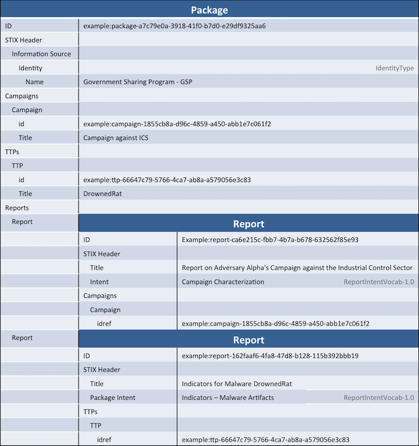

Although not always considered as important as the content itself, the packaging of cyber threat intelligence can often be very important. A basic title, intent, and description of the data is of course important, but other metadata can include data handling instructions, information about the source of the data, and information about how the data was generated. This idiom describes representing a bundle of content coming from one source but containing several unrelated reports.

## Scenario

In this scenario, two unrelated threat reports are distributed by a government sharing program via a single document at the same time. This was considered easier from an operational perspective than just distributing them separately, but other than that they are not related at all. The first report is a high-level report on an adversary's campaign against a particular industry sector while the second is a set of indicators for a piece of malware.

## Data model

### STIX_Package vs. Report


**Note:** This guide is only applicable to STIX 1.2. In previous versions of STIX, the `STIX_Package` construct was used both as a wrapper for unrelated content and to denote related content as a report.


[STIX_Package](/data-model/{{site.current_version}}/stix/STIXType) is simply a way to wrap up STIX content so that it can be transferred in the same document, marked in the same way, compliant with the same profile, and/or given the same `Information_Source`. It in no way implies that the content is related in any way (other than the fact that you got it from the source in the same package). [Report](/data-model/{{site.current_version}}/report/ReportType), on the other hand, is not used to transfer content but is specifically meant to give shared context to a set of STIX content that is related in some way. Remember: use `STIX_Package` to transfer all content and then use `Report` as necessary to group it contextually.

For example, the following types of content would probably have reports:

- A whitepaper on how a threat actor uses a piece of malware
- A description of evolving attack patterns used to deliver malware
- A set of indicators relevant to one particular campaign with some extra context on why they're relevant to the consumer

The following types of content would probably not have reports:

- A simple IP watchlist where the IPs are unrelated (other than all being malicious)
- A group of related STIX content without any extra context beyond that captured in the relationships
- A set of indicators relevant to one particular campaign without any context as to why they're all relevant to the consumer

Put simply: if you have something to say about the set of content **that cannot be expressed in the content itself** (expressing in content via relationships and in-place titles/descriptions is always preferred) then you should use one or more reports.

This example describes how to distribute multiple reports as part of a scheduled release of STIX content. For example, many sharing programs have a daily or weekly release of all of their reports. Each report is self-contained, but all are released by the same organization at the same time. The data model, as you would expect, contains a single STIX_Package, a set of content included in both reports, and the two reports.

**In order to focus on the important parts of this idiom the content itself is limited to just a notional campaign and TTP. In practice you would of course have much more content for each of these reports.**

### Using the STIX_Package wrapper

The outer wrapper serves several purposes:

1. It allows all content to be conveyed in a single document by serving as the "root"
2. It allows you to apply data markings and/or information source across all content in the document (for example, TLP or copyright) rather than having to do it individually.
3. It allows you to express which profile(s) the content conforms to via the `Profiles` element.

As explained above, this wrapper is conveyed via a `STIX_Package` with a `STIX_Header`. In this case we simply represent a common information source for all material contained in the package.

Each report is represented as a `Report` element inside the outer level `STIX_Package` in the same way that the content it refers to. Like packages, reports consist of a header and then a set of content included in the report. Unlike package, however, reports are expected to reference content defined externally rather than directly embed it. This goes back to the purpose of the constructs: packages are about conveying content (and therefore embed it), while reports are about relating content with some shared context (and therefore reference it). While reports do allow you to embed content directly, the suggested practice is that you simply reference it.

In this case, we'll follow the suggested practice and reference content included parent package. The two reports are given separate package intents, titles, and descriptions and include references to the content included within them. The information source is inherited from the package and does not need to be re-stated in the individual reports.

## XML


<stix:STIX_Package
	xmlns:campaign="http://stix.mitre.org/Campaign-1"
	xmlns:cybox="http://cybox.mitre.org/cybox-2"
	xmlns:cyboxCommon="http://cybox.mitre.org/common-2"
	xmlns:cyboxVocabs="http://cybox.mitre.org/default_vocabularies-2"
	xmlns:example="http://example.com"
	xmlns:report="http://stix.mitre.org/Report-1"
	xmlns:stix="http://stix.mitre.org/stix-1"
	xmlns:stixCommon="http://stix.mitre.org/common-1"
	xmlns:stixVocabs="http://stix.mitre.org/default_vocabularies-1"
	xmlns:ttp="http://stix.mitre.org/TTP-1"
	xmlns:xsi="http://www.w3.org/2001/XMLSchema-instance" id="example:Package-50578bc7-bb17-4f31-abf2-d5827d131368" version="1.2" timestamp="2015-05-07T14:22:14.761012+00:00">
    <stix:STIX_Header>
        <stix:Information_Source>
            <stixCommon:Identity>
                <stixCommon:Name>Government Sharing Program - GSP</stixCommon:Name>
            </stixCommon:Identity>
        </stix:Information_Source>
    </stix:STIX_Header>
    <stix:TTPs>
        <stix:TTP id="example:ttp-66647c79-5766-4ca7-ab8a-a579056e3c83" timestamp="2015-05-07T14:22:14.760302+00:00" xsi:type='ttp:TTPType'>
            <ttp:Title>DrownedRat</ttp:Title>
        </stix:TTP>
    </stix:TTPs>
    <stix:Campaigns>
        <stix:Campaign id="example:campaign-1855cb8a-d96c-4859-a450-abb1e7c061f2" timestamp="2015-05-07T14:22:14.760144+00:00" xsi:type='campaign:CampaignType'>
            <campaign:Title>Campaign against ICS</campaign:Title>
        </stix:Campaign>
    </stix:Campaigns>
    <stix:Reports>
        <stix:Report timestamp="2015-05-07T14:22:14.760467+00:00" id="example:Report-ab11f431-4b3b-457c-835f-59920625fe65" xsi:type='report:ReportType' version="1.0">
            <report:Header>
                <report:Title>Report on Adversary Alpha's Campaign against the Industrial Control Sector</report:Title>
                <report:Intent xsi:type="stixVocabs:ReportIntentVocab-1.0">Campaign Characterization</report:Intent>
                <report:Description>Adversary Alpha has a campaign against the ICS sector!</report:Description>
            </report:Header>
            <report:Campaigns>
                <report:Campaign idref="example:campaign-1855cb8a-d96c-4859-a450-abb1e7c061f2" xsi:type='campaign:CampaignType'/>
            </report:Campaigns>
        </stix:Report>
        <stix:Report timestamp="2015-05-07T14:22:14.760756+00:00" id="example:Report-f14804d5-3ee1-4a0e-b0f3-f9a643855ba5" xsi:type='report:ReportType' version="1.0">
            <report:Header>
                <report:Title>Indicators for Malware DrownedRat</report:Title>
                <report:Intent xsi:type="stixVocabs:ReportIntentVocab-1.0">Indicators - Malware Artifacts</report:Intent>
            </report:Header>
            <report:TTPs>
                <stix:TTP idref="example:ttp-66647c79-5766-4ca7-ab8a-a579056e3c83" xsi:type='ttp:TTPType'/>
            </report:TTPs>
        </stix:Report>
    </stix:Reports>
</stix:STIX_Package>



[Full XML](multiple-reports-in-package.xml)

## Python


campaign = Campaign(title="Campaign against ICS")
ttp = TTP(title="DrownedRat")

alpha_report = Report()
alpha_report.header = Header()
alpha_report.header.title = "Report on Adversary Alpha's Campaign against the Industrial Control Sector"
alpha_report.header.descriptions = "Adversary Alpha has a campaign against the ICS sector!"
alpha_report.header.intents = "Campaign Characterization"
alpha_report.add_campaign(Campaign(idref=campaign._id))

rat_report = Report()
rat_report.header = Header()
rat_report.header.title = "Indicators for Malware DrownedRat"
rat_report.header.intents = "Indicators - Malware Artifacts"
rat_report.add_ttp(TTP(idref=ttp._id))

wrapper = STIXPackage()

info_src = InformationSource()
info_src.identity = Identity(name="Government Sharing Program - GSP")
wrapper.stix_header = STIXHeader(information_source=info_src)
wrapper.add_report(alpha_report)
wrapper.add_report(rat_report)
wrapper.add_campaign(campaign)
wrapper.add_ttp(ttp)

print wrapper.to_xml()



[Full Python](multiple-reports-in-package.py)

## Further Reading

* [STIX Package](/data-model/{{site.current_version}}/stix/STIXType)
* [Report](/data-model/{{site.current_version}}/report/ReportType)
