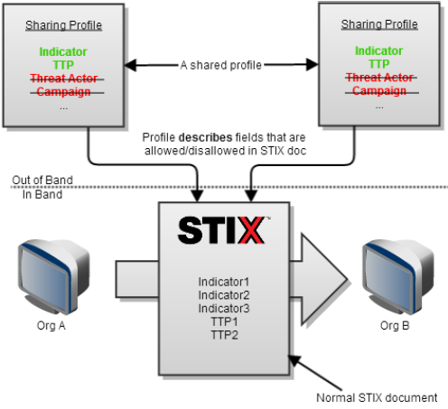
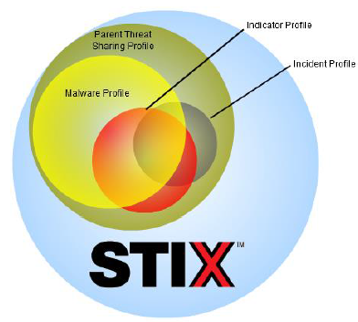

Profiles are a mechanism to describe a particular usage of STIX as practiced by a community, organization, or tool. Continue reading to understand the concept behind profiles, or jump ahead to [representation](representation), [creating a profile](authoring), or [validating against profiles](validation).

## Background

The STIX language was designed to support the full scope of cyber threat intelligence use cases and therefore the data model is fairly broad in scope. It incorporates everything from low-level indicators and observables all the way up to threat actors and campaigns.

This broad scope allows STIX to support a large variety of use cases and correlation across those use cases, but it also means that the full data model is probably not required to support any single use case. For example, an organization using STIX for indicator sharing may not need the threat actor attribution portions of the data model.

STIX profiles are the formalization of this concept: a particular subset of STIX as practiced by a community, organization, or tool.

  <h3>Example Indicator Profile</h3>
  
  
Indicator, observable, and TTP are in-scope but campaign, course of action, exploit target, incident, and threat actor are out-of-scope. The full example of that profile can be downloaded from the STIX <a href="http://stix.mitre.org/language/profiles.html">profile page</a>.

Profiles can be thought of a second compatibility level for STIX content: STIX content can be valid STIX but if it doesn't conform to the rules outlined in the profile it is not compliant with a profile or tools that only support that profile. In fact, the [spreadsheet profile representation](representation) even allows for automated validation of STIX instance content against it.

## Profile rules

Profiles outline several types of rules:

1. **Presence** rules indicate whether fields and constructs are required, suggested, allowed, or prohibited
2. **Implementation** rules indicate that extension points (implemented through [xsi:type](/documentation/concepts/xsi-type)) must have specific implementations
3. **Value** rules indicate that fields have to have a certain set of values
4. **Miscellaneous** rules indicate other requirements that don't fall into the above categories. For example, they might say that if the indicator type field is "IP Watchlist", the contained object must be an address object. These rules are not generally automatically testable but can be included in profiles for human consumption.

## Why are profiles used?

Profiles are used for two primary purposes:

1. To define a shared context for exactly what is expected in an information exchange using STIX.
2. To define a clear scope for tool/service implementation capabilities.

If all parties in an information exchange agree on a profile or an implementation specifies a governing profile it narrows the scope of STIX from the entire data model to just what is specified in the profile.

For users and those defining the sharing model, profiles are useful in reaching a common understanding about what will be shared. The community or set of users can prohibit certain constructs using a profile, for example, to denote that they do not plan to share that sort of information.

For developers, profiles are helpful because they narrow the scope of STIX that must be understood and developed against. Rather than having to understand the full set of STIX constructs and all of the fields of each of those constructs, developers implementing against a profile can limit themselves to just the fields allowed in that profile and users of that implementation can have clear expectations of what sorts of information the implementation can handle.

This diagram illustrates the use of a shared profile between two organizations to facilitate the sharing of a subset of STIX. In this example, the profile specifies that STIX Indicators and TTPs are in scope for the profile – the other top-level STIX objects are not. As such, profiles can assist organizations in establishing governance and policy about what will be shared and can also help guide the implementation of solutions targeted to the subset of STIX defined by a profile.

## Types of profiles

Although all types of profiles indicate similar rules, there are a few distinctions in how to think about profiles meant for different uses.

## Community Profiles

Community profiles describe how a particular sharing community (an industry collaboration group, a government sharing program, etc.) will use STIX. In these types of profiles, you have many parties involved in both producing and consuming information. Community profiles can also be created outside the context of any particular sharing program to help standardize practices across the entire industry.

These profiles should be developed with participation from most or all members of the community to ensure that they aren't too focused on any one technical implementation or one organization's biases. For community profiles, you should consider whether fields will be required, suggested, optional, or prohibited:

* **Required**: All STIX documents **must** include this element to conform to the profile. This should be used only if all community members agree that they can and should populate this field for all content.
* **Suggested**: STIX documents **should** include this element to conform to the profile. This can be used for fields that the community thinks are very useful but may not be available all of the time.
* **Optional**: STIX documents **may** include this element and conform to the profile. This can be used for fields that are useful in some, but not all, situations or for some, but not all, community members.
* **Prohibited**: STIX documents **must not** include this element to conform to the profile. This should be used for all fields that the community feels are not useful. The advantage of marking fields as prohibited is that developers can assume that the fields will not be present and do not have to develop to them.

## Producer Profiles

Producer profiles describe how one particular producer will be creating STIX documents. This is useful for tool developers, commercial threat intelligence feeds, and sharing programs where a single producer is publishing to many consumers. The use of a profile in this case makes it easier for consumers to implement only the portion of STIX that is actually used. It can also help consumers understand the type of information that they producer will be publishing in order to decide whether the feed is worth consuming at all.

Producer profiles can be compared to community profiles to determine whether the producer is compliant with any given community profile. Using the profile layering concept outlined in the profile whitepaper, a producer profile is compatible with a community profile if it is a complete subset (child) of that profile. 

For producer profiles, the producer itself should develop the profile in order to ensure that it is accurate. They should consider whether fields will always be present, might be present, or will never be present:

* **Required (Always Present)**: Fields that will always be present are marked as required in order to line up with the language community profiles use. These fields will **always** be populated in all documents the producer publishes. 

* **Optional (Sometimes Present)**: Fields that will sometimes be present are marked as optional to line up with the language community profiles use. These fields might be present in documents the producer publishes.

* **Prohibited (Never Present)**: Fields that will never be present are marked as prohibited to line up with the language community profiles use. These fields will not be present in documents the producer publishes.

Note that producer profiles don't typically have a "suggested" category. This is because the producer will populate optional fields as defined by the data their product produces and therefore the distinction is less relevant.

## Consumer Profiles

Consumer profiles are essentially compatibility statements: a consumer can create them to demonstrate which portions of STIX they support. They can then be compared to community or producer profiles to determine whether the consumer is compatible.

If a consumer profile is a parent (superset) of either a producer or community profile it can be considered fully compatible. In other cases, it may be a partial superset/subset but have support for ignoring fields it does not handle rather than throwing an error, in which case it can be considered partially compatible. 

For consumer profiles, the consumer should develop the profile to ensure that it is accurate. They should consider whether fields are required, supported, not supported, or will throw an error: 

* **Required** : Fields that **must** be present in a STIX document for this consumer to consume the document without errors. For consumer profiles, this should likely only be ID or other very basic elements. 
* **Suggested** : Fields that may be present in a STIX document and that will be properly handled by any business logic.
* **Optional** : Fields that may be present in a STIX document but will be ignored.
* **Prohibited **: Fields that will cause an error in the consuming tool if present. These should be kept to an absolute minimum.

## Layering profiles

Given the ecosystem of profiles that would likely exist, it's also helpful to think of profiles as supporting *layered compatibility*.

Considering the sharing use case for example, a broad “threat sharing” profile might be defined to detail which constructs are allowed for sharing of threat information in a particular community, while a narrower “indicator sharing” profile might be created based on the threat sharing profile that specifies further constraints on the set of fields or values specifically to what is used for indicator sharing. This is referred to here as “layered” profiles, with the “parent” layer containing a less constrained superset of what is allowed, suggested, required or prohibited in child profiles.

This means that a child profile may:

1. Prohibit fields that were suggested or optional in the parent.
2. Require fields that were suggested or optional in the parent.
3. Further restrict (but not expand) the allowed types or values defined in the parent.

The key is that a child profile is always a further constraint of the parent profile and is never a loosening or expansion.
Because of these rules, any STIX document that complies with a child profile also complies with the parent profile (and, by extension, any of that parent’s parents) because of the upward loosening nature of the layering. Consumers of STIX documents are assured that by fully supporting a parent profile they inherently support STIX content produced according to any of that profile's child profiles and, vice versa, producers of STIX documents can be assured that all consumers that support the parent profile will be able to parse content they produce that is conformant with any of that parent's child profiles.

## Representing profiles

The current representation for STIX profiles is a specifically-formatted Excel spreadsheet. The [representation](representation) page goes into detail on how the format works and the profile templates available on the [release page](http://stix.mitre.org/language/version1.1.1) are a good starting point.

## Validating content against profiles

Though profiles are most useful in the development period for users and developers in the community to agree upon their STIX formats, in some use cases it's also helpful to validate the instance content does indeed conform to the profile. When using the standard Excel format, the [STIX Validator](https://github.com/STIXProject/stix-validator) tool can be used to validate a STIX document against a profile. Further information on this is available on the [profile validation](validation) page.

## Authoring profiles

STIX profiles are generally created through community agreement (for community profiles) or by a product manager or developer documenting what their product will support. An [authoring guide](authoring) is available for those who will be performing the technical work of creating the Excel-formatted spreadsheet.

## Alternative Terms
You may also use terms compliant with [RFC 2119](https://www.ietf.org/rfc/rfc2119.txt) to indicate profile coverage. These terms cannot be intermingled, and are  supported in validation tools as of STIX 1.1.1.1

Term|RFC Term
-----------------
Required|MUST 
Suggested|SHOULD or SHOULD NOT
Optional | MAY
Prohibited|MUST NOT

## Questions?

Profiles are a complicated topic. Please [get in touch](stix-taxii@hq.dhs.gov) with the team if you have any questions or think this documentation could be improved.
