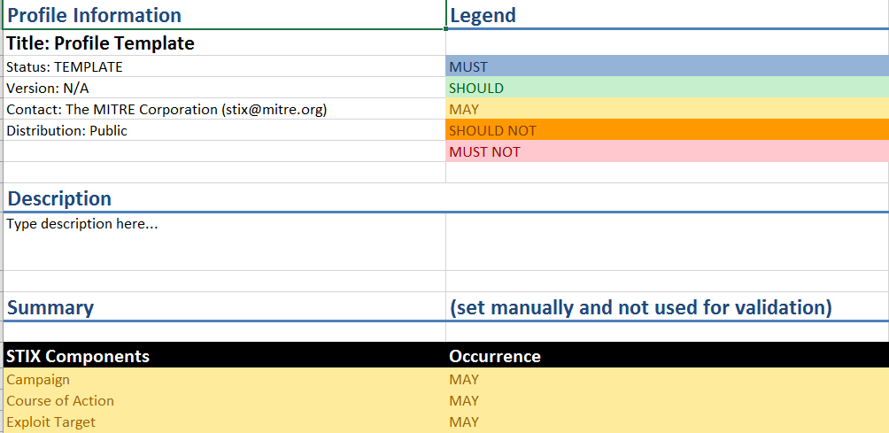
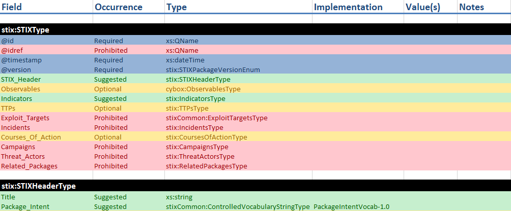

STIX [Profiles](..) are a mechanism to describe a particular usage of STIX as practiced by a community, organization, or tool. Profiles are represented using a specially-formatted Excel spreadsheet. The use of this spreadsheet ensures that all community members consistently create and understand profiles as well as allows for automated [profile validation](../validation).

## Background

Excel was chosen as the initial format because it's machine-processable (through libraries for various programming languages) yet still human-readable. The goals of the format were to ensure that analysts and business owners could understand the subset of STIX that was being discussed, that developers could understand what supporting products needed to support, and that instance documents could be automatically validated against as many of the profile rules as possible.

## Organization

The Excel format is based on a set of tabs in the spreadsheet:

* Overview
* Data tabs (named for STIX/CybOX schemas)
* Namespaces
* Instance Mapping

### Overview

The overview sheet is used to give people reading the profile a high-level understanding of what the profile supports without having to delve into the details. It contains metadata such as the name of the profile, who created it, version, releasability as well as a summary of which STIX components, CybOX objects, vocabularies, and features are supported. The overview tab must be manually configured by the author and is not used for automated validation.

* **Profile Information** gives basic information on the profile and **Description** gives a high-level description.
* **Legend** explains what each color means, using terms appropriate for community profiles.
* **Summary** explains a set of capabilities provided by STIX/CybOX and indicates whether each is prohibited, optional, suggested, or required.

 

### Validation Support

The **Namespaces** and **Instance Mapping** tabs are used only to support automated validation and can be ignored by those reading a profile. Respectively they map namespace prefixes to full namespaces and row headings to the XPaths to find the construct.

### Data Tabs

 

The data tabs contain the actual profile content. Each tab contains all types for a particular STIX or CybOX namespace and indicates how those types may be used. Not all namespaces will be visible in most profiles: profile authors typically hide tabs that are entirely excluded (prohibited) from the profile in order to cut down on noise. For example, an indicator sharing profile likely will not have tabs for Exploit Target or Threat Actor because they're completely prohibited.

 

### Rule Specification

Profile rules are specified in the Occurrence, Implementation, Value(s), and Notes columns.

<table class="table table-bordered table-hover table-condensed">
  <thead>
    <tr>
      <th>Column</th>
      <th>Description</th>
      <th>Format</th>
    </tr>
  </thead>
  <tbody>
    <tr>
      <td>Occurrence</td>
      <td>Indicates whether a particular field is prohibited, optional, suggested, or required. Prohibited fields must not be present in instance content, optional or suggested fields may be present, and required fields must be present. These terms apply to community profiles, but substitute never present, sometimes present, usually present, or always present for equivalent rules from a producer profile perspective. The value of this field also determines the color of the entire row.</td>
      <td>Single Word: Prohibited, Optional, Suggested, Required.</td>
    </tr>
    <tr>
      <td>Implementation</td>
      <td>Indicates a required implementation for an extension point via the <a href="/documentation/concepts/xsi-type">xsi:type</a>. For example, the <code>Type</code> field in indicator might set this to <code>stixVocabs:IndicatorTypeVocab-1.1</code>.</td>
      <td>Comma-separated list of possible implementations</td>
    </tr>
    <tr>
      <td>Value(s)</td>
      <td>Indicates a set of values, one of which is required to be set in the field if the field is present. Note that if the field is marked as optional or suggested, it's also permissible for this field to be absent. If it is present however, it must be set to one of the listed values. This field is only applicable to simple value types, not structured content (i.e. you can't define a set value for a structured field).</td>
      <td>Comma-separated list of possible values</td>
    </tr>
    <tr>
      <td>Notes</td>
      <td>Indicates miscellaneous notes or conformance requirements that don't fall into any other category. This field is meant for human consumption, not automated validation. Even though this field is not automatically validated, conformance rules specified here are considered normative for the profile and documents that do not conform are not considered compliant even if they pass automated validation.</td>
      <td>Free text</td>
    </tr>
  </tbody>
</table>

## Understanding profiles

STIX profiles are based defining rules for how STIX types may be used. For example, the top-level of any STIX document is `STIX_Package`, which is an instance of [STIXType](/data-model/{{site.current_version}}/stix/STIXType) in the STIX Core schema. Therefore, the rules that define how STIX_Package must be used can be found in the `STIXType` section of the `STIX Core` profile tab. That tab lists each field and the rules for that field.

For each field that is permitted in the profile (required, suggested, or optional) the type that defines that field will also be present, with two exceptions: simple types (strings, numbers, text, etc.) without structure don't need to be defined and are not present, and types in external schemas may not be present. Other types, however, will be present in their corresponding tab and will also be fully defined.

Types that are not referenced from anywhere else (i.e. types whose only instantiations are marked prohibited) are generally hidden by profile authors because they're inaccessible in instance documents. They're considered completely prohibited by proxy because all the places they may be used are prohibited.

## Questions?

Profiles are a complicated topic. Please [get in touch](mailto:stix@mitre.org) with the team if you have any questions or think this documentation could be improved.
