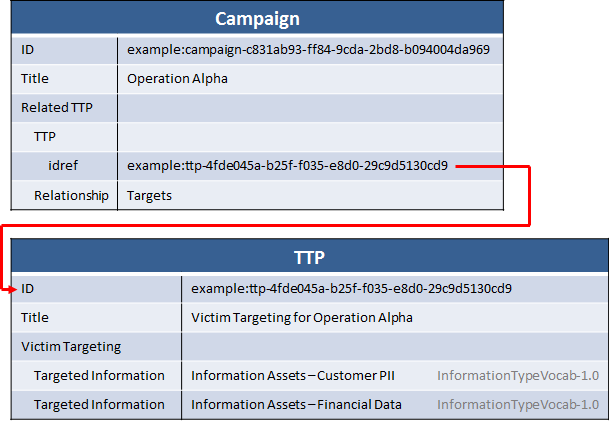

One common method by which cyber threat campaigns are defined and tracked is based on the types of victims they target, whether victims are defined by the victim themselves (where they are located, the types of work they do), or by the fact that they have certain types of information or systems (customer PII, Industrial Control Systems, etc), or by the fact that they target specific technical configurations (a certain browser or OS for example).

This idiom describes the representation of a cyber threat campaign characterized by the fact that it targets customer PII and financial information.

## Data model

There are two main pieces of information that need to be communicated in this idiom: the campaign construct itself (using [CampaignType](/documentation/campaign/CampaignType)) and the victim targeting (using [VictimTargetingType](/documentation/ttp/VictimTargetingType)) in TTP. These are related together using the Campaign=>Related_TTP relationship.

The campaign is represented with just a title and a related TTP with a relationship name of "Targets". The TTP leverages the victim targeting constructs to represent the types of information that are targeted. For targeting of a specific type of information, the `Targeted Information` field is used, leveraging the controlled vocabulary for information types, [InformationTypeVocab-1.0](/documentation/stixVocabs/InformationTypeVocab-1.0/).

## XML


<stix:TTPs>
    <stix:TTP xsi:type="ttp:TTPType" id="example:ttp-4fde045a-b25f-f035-e8d0-29c9d5130cd9" timestamp="2014-02-20T09:00:00.000000Z">
        <ttp:Title>Victim Targeting: Customer PII and Financial Data</ttp:Title>
        <ttp:Victim_Targeting xsi:type="ttp:VictimTargetingType">
            <ttp:Targeted_Information xsi:type="stixVocabs:InformationTypeVocab-1.0">Information Assets - Customer PII</ttp:Targeted_Information>
            <ttp:Targeted_Information xsi:type="stixVocabs:InformationTypeVocab-1.0">Information Assets - Financial Data</ttp:Targeted_Information>
        </ttp:Victim_Targeting>
    </stix:TTP>
</stix:TTPs>
<stix:Campaigns>
    <stix:Campaign xsi:type="campaign:CampaignType" id="example:campaign-c831ab93-ff84-9cda-2bd8-b094004da969" timestamp="2014-02-20T09:00:00.000000Z">
        <campaign:Title>Operation Alpha</campaign:Title> 
        <campaign:Related_TTPs>
            <campaign:Related_TTP>
                <stixCommon:Relationship>Targets</stixCommon:Relationship>
                <stixCommon:TTP xsi:type="ttp:TTPType" idref="example:ttp-4fde045a-b25f-f035-e8d0-29c9d5130cd9"/>    
            </campaign:Related_TTP>
        </campaign:Related_TTPs>
    </stix:Campaign>
</stix:Campaigns>


[Full XML](victim-targeting.xml)

## Python


from stix.campaign import Campaign
from stix.common.related import RelatedTTP
from stix.core import STIXPackage
from stix.ttp import TTP

ttp = TTP()
ttp.title = "Victim Targeting: Customer PII and Financial Data"
ttp.victim_targeting.add_targeted_information("Information Assets - Customer PII")
ttp.victim_targeting.add_targeted_information("Information Assets - Financial Data")

ttp_ref = TTP()
ttp_ref.idref = ttp.id_
related_ttp = RelatedTTP(ttp_ref)
related_ttp.relationship = "Targets"

c = Campaign()
c.title = "Operation Alpha"
c.related_ttps.append(related_ttp)

pkg = STIXPackage()
pkg.add_campaign(c)
pkg.add_ttp(ttp)

print pkg.to_xml()


[Full Python](victim-targeting.py)

## Further Reading

You can build on this idiom by representing other types of victim targeting in the TTP:

* [Targeting by Industry Sector](/idioms/ttp/industry-sector)

See the full documentation for the relevant types for further information that may be provided:

* [CampaignType](/documentation/campaign/CampaignType)
* [TTPType](/documentation/ttp/TTPType)
* [VictimTargetingType](/documentation/ttp/VictimTargetingType)
