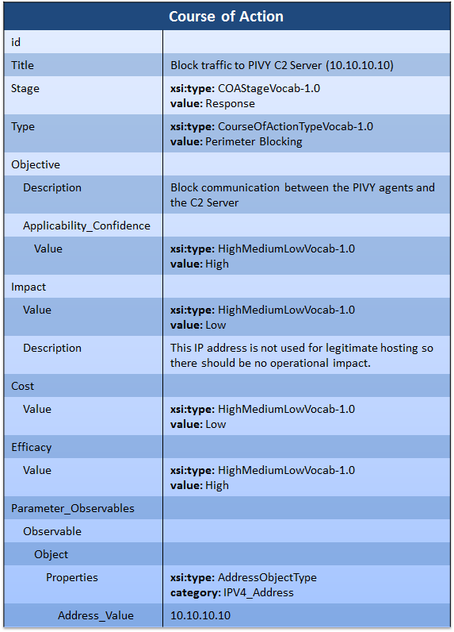

One potential course of action in response to an attack is to block network traffic associated with that attack. This idiom describes how that course of action can be represented in STIX.

## Scenario

In this scenario, an organization wishes to represent a course of action describing blocking traffic to a known PIVY C2 server located at a specific IP address.

## Data model

The focus of this data model is of course on the STIX [Course of Action](/documentation/coa/CourseOfActionType) component. The course of action is represented as a simple description with structured fields for the cost, efficacy, stage, and type of the course of action. A parameter is also given that indicates, using CybOX, the IP address to block.

The `Title` field simply gives the course of action a human-readable title. Similarly, `Description` and `Short Description` could be used to give it longer human-readable descriptions if desired.

The `Stage` field describes the stage of the response process that the course of action is used at. This is a [controlled vocabulary](/idioms/features/controlled-vocabularies) where the default vocabulary is [COAStageVocab-1.0](/documentation/stixVocabs/COAStageVocab-1.0). For this idiom, the action is a response to some known activity so it's set to "Response".

The `Type` field, also a controlled vocabulary (default is [CourseOfActionTypeVocab-1.0](/documentation/stixVocabs/CourseOfActionTypeVocab-1.0)), indicates what general type of course of action is being described. This COA describes blocking of an IP address by perimeter firewalls, so is set to "Perimeter Blocking".

The `Objective` field describes the intended purpose of the course of action at a technical level. It consists of a text description describing that objective and a [confidence](/idioms/features/confidence) that the COA will achieve that objective. Since the objective is strightforward and the COA has a high degree of success in achieving it, that is set to high.

The `Impact` field describes the expected impact that implementing the course of action will have on normal operations. It uses [StatementType](/documentation/stixCommon/StatementType), which consists of a set of fields allowing the information producer to assert a statement about something. In this case, the `Value` field of the statement is set to "Low" (using the defualt vocabulary for this statement, [HighMediumLowVocab-1.0](/documentation/stixVocabs/HighMediumLowVocab-1.0)) and a description is given as to why the impact is low. Because this COA involves blocking an IP address that is not used for any legitimate purposes the impact to operations will be low.

Similarly, the `Cost` field is a [StatementType](/documentation/stixCommon/StatementType) field that describes the estimated cost of applying the course of action. Applying a firewall rule is cheap, and therefore the field value is set to "Low". No description is given because the statement is simple enough to not require a justification or further explanation. The `Efficacy` is yet another [StatementType](/documentation/stixCommon/StatementType) field describes the effectiveness of the COA assuming it is successful in achieving its objective.

The `Parameter Observables` field is a set of CybOX [Observables](/documentation/cybox/ObservablesType) that describe the technical parameters to the course of action. In combination with the `Type` field, these could be used to automatically convert the course of action into something actionable in a security tool. Alternatively, they can simply be displayed in a structured fashion to the end user. In this case, the CybOX [AddressObject](/documentation/AddressObj/AddressObjectType/) is used to represent the IP address that should be blocked.

## XML


<stix:Course_Of_Action xsi:type="coa:CourseOfActionType" id="example:coa-55f57cc7-ddd5-467b-a3a2-6fd602549d9e" timestamp="2014-02-20T09:00:00.000000Z">
    <coa:Title>Block traffic to PIVY C2 Server (10.10.10.10)</coa:Title>
    <coa:Stage xsi:type="stixVocabs:COAStageVocab-1.0">Response</coa:Stage>
    <coa:Type xsi:type="stixVocabs:CourseOfActionTypeVocab-1.0">Perimeter Blocking</coa:Type>
    <coa:Objective>
        <coa:Description>Block communication between the PIVY agents and the C2 Server</coa:Description>
        <coa:Applicability_Confidence>
            <stixCommon:Value xsi:type="stixVocabs:HighMediumLowVocab-1.0">High</stixCommon:Value>
        </coa:Applicability_Confidence>
     </coa:Objective>
     <coa:Parameter_Observables cybox_major_version="2" cybox_minor_version="1">
        <cybox:Observable id="example:Observable-9667bc6e-a0fc-49cd-a2e6-18ed2ef83519">
            <cybox:Object id="example:Object-b7ecdc5e-9fca-4c69-b053-5641c9b3b839">
                <cybox:Properties xsi:type="AddressObject:AddressObjectType" category="ipv4-addr">
                    <AddressObject:Address_Value condition="Equals">10.10.10.10</AddressObject:Address_Value>
                </cybox:Properties>
            </cybox:Object>
        </cybox:Observable>
    </coa:Parameter_Observables>
    <coa:Impact>
        <stixCommon:Value xsi:type="stixVocabs:HighMediumLowVocab-1.0">Low</stixCommon:Value>
        <stixCommon:Description>This IP address is not used for legitimate hosting so there should be no operational impact.</stixCommon:Description>
    </coa:Impact>
    <coa:Cost>
        <stixCommon:Value xsi:type="stixVocabs:HighMediumLowVocab-1.0">Low</stixCommon:Value>
    </coa:Cost>
    <coa:Efficacy>
        <stixCommon:Value xsi:type="stixVocabs:HighMediumLowVocab-1.0">High</stixCommon:Value>
    </coa:Efficacy>
</stix:Course_Of_Action>


[Full XML](COA-to-block-network-traffic.xml)

## Further Reading

See the full documentation for the relevant types for further information that may be provided:

* [CourseOfActionType](/documentation/coa/CourseOfActionType)
* [IndicatorType](/documentation/indicator/IndicatorType) - One common usage of courses of action is through the suggested course of action for an indicator.