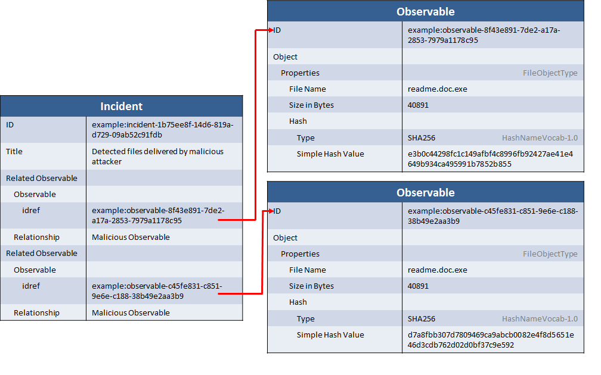

During the course of an incident investigation it's useful to record the pieces of observable data that led to the discovery of the incident or that were detected and presumed to be malicious on behalf of the attacker. These can be captured in a vendor-independent manner using [CybOX](http://cybox.mitre.org) and then related into STIX incident records.

## Scenario

This scenario consists of an incident where during the investigation, it was determined that 3 files discovered on end user systems were traced back to the attacher. The idiom describes representing the incident itself with just a title and the set of related files.

## Data model

This idiom is represented as a relationship between the [Incident](/documentation/incident/IncidentType) component and the CybOX [Observable](/documentation/cybox/ObservableType) component. The incident describes information specific to the incident itself while the observable contains a list of file names, sizes, and hashes that were found. The `Related Observables` relationship is used to indicate that the observables were traced back to the attacker.

#### Observables

The observables are represented using CybOX [Observables](/documentation/cybox/ObservableType) that leverage the [File Object](/documentation/FileObj/FileObjectType). Each file has three fields that are filled out: the `Hash` field (within a hash structure) is the hash of the file, the `File_Name` field contains the name (not path) of the file, and the `Size` field contains the size in bytes of the file.

Notice that, unlike when working with indicators, these are CybOX instance objects rather than patterns. Therefore the CybOX patterning capabilities such as conditions and apply conditions are not leveraged.

#### Incident

Given the constrained scenario, the incident construct is fairly limited: it contains a `Title` to identify the incident and a set of `Related Observable`s. The observable references point to the individual observables defined above each relationship is characterized as "Malicious Observable".

## XML


<stix:Observables cybox_major_version="2" cybox_minor_version="1">
    <cybox:Observable id="example:observable-8f43e891-7de2-a17a-2853-7979a1178c95">
        <cybox:Object id="example:object-3d77c3fe-9e96-4967-bff8-1184dd82ad4a">
            <cybox:Properties xsi:type="FileObj:FileObjectType">
                <FileObj:File_Name>readme.doc.exe</FileObj:File_Name>
                <FileObj:Size_In_Bytes>40891</FileObj:Size_In_Bytes>
                <FileObj:Hashes>
                    <Hash xmlns="http://cybox.mitre.org/common-2">
                        <Type xsi:type="cyboxVocabs:HashNameVocab-1.0">SHA256</Type>
                        <Simple_Hash_Value>e3b0c44298fc1c149afbf4c8996fb92427ae41e4649b934ca495991b7852b855</Simple_Hash_Value>
                    </Hash>
                </FileObj:Hashes>
            </cybox:Properties>
        </cybox:Object>
    </cybox:Observable>
    <cybox:Observable id="example:observable-c45fe831-c851-9e6e-c188-38b49e2aa3b9">
        <cybox:Object id="example:object-e492bfe4-b62d-41a5-b2eb-d6784413bbba">
            <cybox:Properties xsi:type="FileObj:FileObjectType">
                <FileObj:File_Name>readme.doc.exe</FileObj:File_Name>
                <FileObj:Size_In_Bytes>40891</FileObj:Size_In_Bytes>
                <FileObj:Hashes>
                    <Hash xmlns="http://cybox.mitre.org/common-2">
                        <Type xsi:type="cyboxVocabs:HashNameVocab-1.0">SHA256</Type>
                        <Simple_Hash_Value>d7a8fbb307d7809469ca9abcb0082e4f8d5651e46d3cdb762d02d0bf37c9e592</Simple_Hash_Value>
                    </Hash>
                </FileObj:Hashes>
            </cybox:Properties>
        </cybox:Object>
    </cybox:Observable>
</stix:Observables>
<stix:Incidents>
    <stix:Incident xsi:type="incident:IncidentType" id="example:incident-1b75ee8f-14d6-819a-d729-09ab52c91fdb" timestamp="2014-03-20T11:15:00.000000Z">
        <incident:Related_Observables>
            <incident:Related_Observable>
                <stixCommon:Relationship>Malicious Observable</stixCommon:Relationship>
                <stixCommon:Observable idref="example:observable-8f43e891-7de2-a17a-2853-7979a1178c95"/>
            </incident:Related_Observable>
            <incident:Related_Observable>
                <stixCommon:Relationship>Malicious Observable</stixCommon:Relationship>
                <stixCommon:Observable idref="example:observable-c45fe831-c851-9e6e-c188-38b49e2aa3b9"/>
            </incident:Related_Observable>
        </incident:Related_Observables>
    </stix:Incident>
</stix:Incidents>


[Full XML](incident-with-related-observables.xml)

## Python


from stix.core import STIXPackage
from stix.incident import (Incident, RelatedObservables)
from stix.common.related import (RelatedObservable)
from cybox.core import Observable
from cybox.common import Hash
from cybox.objects.file_object import File

file_object1 = File()
file_object1.file_name = "readme.doc.exe"
file_object1.size_in_bytes = 40891
file_object1.add_hash(Hash("e3b0c44298fc1c149afbf4c8996fb92427ae41e4649b934ca495991b7852b855"))
observable1 = Observable(file_object1)
    
file_object2 = File()
file_object2.file_name = "readme.doc.exe"
file_object2.size_in_bytes = 40891
file_object2.add_hash(Hash("d7a8fbb307d7809469ca9abcb0082e4f8d5651e46d3cdb762d02d0bf37c9e592"))
observable2 = Observable(file_object2)
    
incident = Incident(title="Detected files delivered by malicious attacker")
    
related_observable1 = RelatedObservable(observable1, relationship="Malicious Observable")
related_observable2 = RelatedObservable(observable2, relationship="Malicious Observable")
incident.related_observables.append(related_observable1)
incident.related_observables.append(related_observable2)

print incident.to_xml()


[Full Python](incident-with-related-observables.py)

## Further Reading

See the full documentation for the relevant types for further information that may be provided:

* [IncidentType](/documentation/incident/IncidentType)
