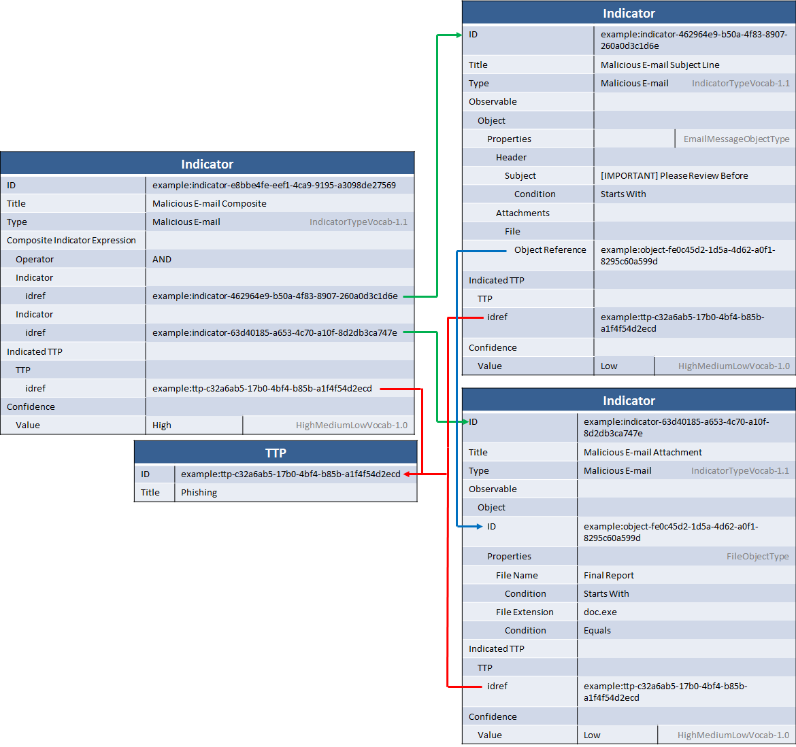

Given that phishing is such a common attack vector, the ability to represent indicators for malicious e-mail is critical. In particular, indicators must be able to represent information about the e-mail itself (subject, sender, header information, etc.) as well as any attachments or links. This idiom describes representing a set of indicators for a malicious e-mail that has one attachment.

## Scenario

This scenario consists of several related indicators used to represent a malicious e-mail. The e-mail has a somewhat subject (it always starts with "[IMPORTANT] Please Review Before" and is followed by a date in the near future) asking for a document to be reviewed but has a random sender. It includes an attachment to a file with the extension ".doc.exe", but the actual file is somewhat variable so no consistent hash could be identified.

## Data model

The data model for this idiom is fairly complicated because the set of matchable patterns is varied: an e-mail could come in that matches the subject but ends in ".ppt.exe" instead of ".doc.exe", or it might come in and match ".doc.exe" but not match the subject pattern, or it might match both. To represent this in the data, three indicators are used: one indicator for the e-mail subject pattern with low confidence, one indicator for the attachment pattern with low confidence, and one indicator as a composite AND with high confidence. That way if only one fact or the other matches it's clearer that the match may be less accurate, while a match of both is more accurate.

In addition, CybOX object relationships are used within each observable to indicate that the file was attached to the e-mail. This is not important for indicator matching but can help correlate the objects with other information upon a match being found or even absent a match.

Finally, a very simple indicated TTP is present in order to indicate that if the composite (or either individual) indicator matches it indicates a potential phishing attempt.

Yes, this diagram is fairly complicated. It's easiest to understand if you take a look at each object and its relationships separately.

### E-mail Indicator

The e-mail subject indicator, in the top-right, matches the e-mail pattern itself (specifically the subject line). It has a `Title` and a `Type` (using the [IndicatorTypeVocab-1.1](/documentation/stixVocabs/IndicatorTypeVocab-1.0) vocabulary) to give it some basic identifying information meant for humans. The "test" portion of the indicator consists of an [Observable](/documentation/cybox/ObservableType) with an [Email Message Object](/documentation/EmailMessageObj/EmailMessageObjectType). The pattern for the subject is that it always starts with the same text, so the field value for e-mail `Subject` field (inside the `Header`) is set to "[IMPORTANT] Please Review Before" and the CybOX `Condition` field is set to "Starts With" to indicate that the pattern should match if an e-mail is matched against it whose subject line starts with that text.

The fact that the e-mail contains an attachment is contained in the `Attachments` field, which has a list of references to [File](/documentation/FileObj/FileObjectType) objects using the CybOX object reference mechanism. This reference is indicated by the blue line and resolves to the actual file object characterization, contained in the second indicator.

The indicated TTP for the indicator gives the indicator some context (relationship line in red). In this case, it says that if you see something that matches the pattern it indicates that you could have a phishing attack. In order to focus on the indicator portion of the data model for this idiom, the TTP was left purposefully vague but could easily be filled in with the more advanced [TTP idioms](/idioms/ttp).

Finally, the `Confidence` field is used to indicate that this indicator is "Low" confidence (using the default vocabulary in STIX for confidence, [HighMediumLowVocab-1.0](/documentation/stixVocabs/HighMediumLowVocab-1.0)).

The file indicator, immediately below that, has much the same structure. Instead of the email message object, however, it has the [File](/documentation/FileObj/FileObjectType) object representing the attachment. The `File Name` field is set to "Final Report" and the `Condition` attribute of that field is set to "Starts With" to indicate that the file name of the attachment should match if it starts with "Final Report". The `File Extension` field is set to match only if the extension is exactly "doc.exe". The rest of the indicator is similar to the email indicator, so let's move on to the composite indicator.

The composite indicator uses the `Composite_Indicator_Expression` field to create an AND group. That field uses the [CompositeIndicatorExpressionType](/documentation/indicator/CompositeIndicatorExpressionType) to describe a nested set of ANDed and ORed indicators. In this case, two references are created to the existing indicators (relationship line in green) and the `Operator` field is used to indicate that the composite should match only if BOTH of the included indicators match.

The composite indicator has the same indicated TTP as the other two indicators, however note that the `Confidence` is high. This type of combination of a set of individual indicators with low confidence along with a composite AND with high confidence can help drive both high quality matches if everything matches exactly but also match (at a lower level of confidence) if the adversary changes their TTP slightly. It's recommended to use this composite approach whenever you have individual pieces of information that might match by themselves but indicate a stronger match when they match together.

## XML





[Full XML](malicious-email-indicator.xml)

## Python

from stix.core import STIXPackage
from stix.common import Confidence
from stix.indicator import Indicator, CompositeIndicatorExpression
from stix.ttp import TTP
from cybox.core import Observable
from cybox.objects.file_object import File
from cybox.objects.email_message_object import (EmailMessage, EmailHeader,
                                                Attachments, AttachmentReference)

stix_package = STIXPackage()
ttp = TTP(title="Phishing")
stix_package.add_ttp(ttp)

comp_indicator = Indicator(title="Malicious E-mail Composite")
comp_indicator.add_indicator_type("Malicious E-mail")
comp_indicator.confidence = Confidence(value="High")

email = EmailMessage()
email.header = EmailHeader()
email.header.subject = "[IMPORTANT] Please Review Before"
email.header.subject.condition = "StartsWith"
email.attachments = Attachments()

file_attachment = File()
file_attachment.file_name = "Final Report"
file_attachment.file_name.condition = "StartsWith"
file_attachment.file_extension = "doc.exe"

email.attachments.append(file_attachment.parent.id_)

indicator_email = Indicator()
indicator_email.title = "Malicious E-mail Subject Line"
indicator_email.add_indicator_type("Malicious E-mail")
indicator_email.observable = email
indicator_email.confidence = "Low"

indicator_attachment = Indicator()
indicator_attachment.title = "Malicious E-mail Attachment"
indicator_attachment.add_indicator_type("Malicious E-mail")
indicator_attachment.observable = file_attachment    
indicator_attachment.confidence = "Low"

indicator_email.add_indicated_ttp(TTP(idref=ttp.id_))
indicator_attachment.add_indicated_ttp(TTP(idref=ttp.id_))
comp_indicator.add_indicated_ttp(TTP(idref=ttp.id_))

comp_indicator.composite_indicator_expression = CompositeIndicatorExpression(operator="AND")
comp_indicator.composite_indicator_expression.append(Indicator(idref=indicator_email.id_))
comp_indicator.composite_indicator_expression.append(Indicator(idref=indicator_attachment.id_))

stix_package.indicators = [comp_indicator, indicator_email, indicator_attachment]
print stix_package.to_xml()


[Full Python](malicious-email-indicator-with-attachment.py)

## Further Reading

* [Indicator Type](/documentation/indicator/IndicatorType)
* [CybOX File Object](/documentation/FileObj/FileObjectType)