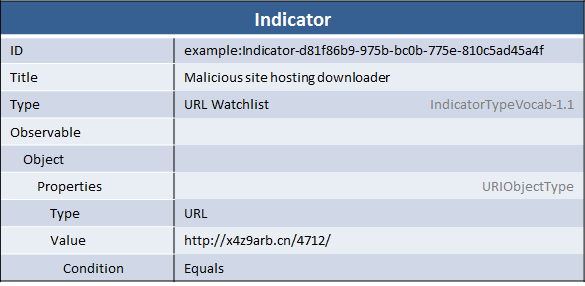

A very common method for delivering malware to potential targets is to host it at a particular URL. Targets are then directed to that URL via a phishing e-mail or a link from another site and, when they reach it, are exploited. Sharing lists of malicious URLs can be an effective and cheap way to limit exposure to malicious code.

## Scenario

This scenario consists of an indicator the URL "http://x4z9arb.cn/4712/", which is known to be malicious. Unlike the [C2 beaconing](/idioms/indicator/c2-indicator) and [Malware hash](/idioms/indicator/malware-hash) idioms, in this scenario the organization creating the indicator does not have any specific context and so chooses to just represent the indicator. Though it's suggested that some context always be given with an indicator if possible, in this case the organization does not have enough additional context to add anything.

## Data model

Because this indicator doesn't include any context (see scenario above), the indicator itself is the only top-level component. Within the indicator, the URL is represented as a [URI Object](/documentation/URIObj/URIObjectType) with the `Type` set to "URL" and the `Value` set to the malicious URL itself ("http://x4z9arb.cn/4712/").

## XML





[Full XML](url-indicator.xml)

## Python


from stix.core import STIXPackage
from stix.indicator import Indicator
from cybox.objects.uri_object import URI

indicator = Indicator()
indicator.id_ = "example:package-382ded87-52c9-4644-bab0-ad3168cbad50"
indicator.title = "Malicious site hosting downloader"
indicator.add_indicator_type("URL Watchlist")
    
url = URI()
url.value = "http://x4z9arb.cn/4712"
url.type_ =  URI.TYPE_URL
    
indicator.add_observable(url)
print indicator.to_xml()


[Full Python](indicator-for-malicious-url.py)

## Further Reading

* [Indicator Type](/documentation/indicator/IndicatorType)
* [CybOX URI Object](/documentation/URIObj/URIObjectType)