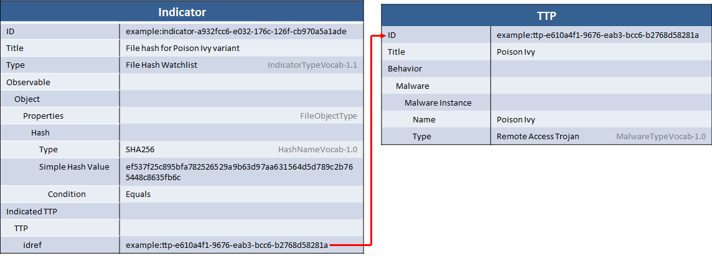

A commonly-shared form of threat intelligence as practiced today is the sharing of host-based indicators for malicious code, which are most often file names and hashes. This idiom describes a file hash indicator and the name and type of the piece of malware that it indicates.

## Scenario

This scenario consists of the description of a simple indicator that represents a test for a file hash and the context that if the hash is seen it might indicate a particular Poison Ivy variant.

## Data model

As with all indicators, the data model consists of two primary components: the "test" portion describing some pattern of cyber observables to look for, and the "context" portion describing what it means if that observable is actually sighted.

In this case, the "test" portion consists of a SHA256 hash for the malicious file itself. The "context" portion indicates that the file indicates the presence of the Poison Ivy malware variant.

In the diagram above, the Indicator component contains the test: a CybOX [File Object](/documentation/FileObj/FileObjectType/) with a `Simple Hash Value` of the SHA256 hash (denoted in the `Type` field of the `Hash`) to check for. The `Indicated TTP` then uses a [STIX Relationship](/idioms/features/relationships) to link to a TTP that describes the indicator. Note that, besides the TTP, the indicator `Type` field is also used to give the indicator some context.

## XML


    <stix:Indicators>
        <stix:Indicator id="example:indicator-a932fcc6-e032-176c-126f-cb970a5a1ade" xsi:type='indicator:IndicatorType' negate="false" version="2.1">
            <indicator:Title>File hash for Poison Ivy variant</indicator:Title>
            <indicator:Type xsi:type="stixVocabs:IndicatorTypeVocab-1.0">File Hash Watchlist</indicator:Type>
            <indicator:Observable id="example:Observable-7d6f87bb-b4cd-42dd-b655-72557e9ea79f">
                <cybox:Object id="example:File-91040dc2-28d8-4925-bfe8-6b50d300afe1">
                    <cybox:Properties xsi:type="FileObj:FileObjectType">
                        <FileObj:Hashes>
                            <cyboxCommon:Hash>
                                <cyboxCommon:Type xsi:type="cyboxVocabs:HashNameVocab-1.0">SHA256</cyboxCommon:Type>
                                <cyboxCommon:Simple_Hash_Value condition="Equals">ef537f25c895bfa782526529a9b63d97aa631564d5d789c2b765448c8635fb6c</cyboxCommon:Simple_Hash_Value>
                            </cyboxCommon:Hash>
                        </FileObj:Hashes>
                    </cybox:Properties>
                </cybox:Object>
            </indicator:Observable>
            <indicator:Indicated_TTP>
                <stixCommon:TTP idref="example:ttp-e610a4f1-9676-eab3-bcc6-b2768d58281a" xsi:type='ttp:TTPType' version="1.1"/>
            </indicator:Indicated_TTP>
        </stix:Indicator>
    </stix:Indicators>
    <stix:TTPs>
        <stix:TTP id="example:ttp-e610a4f1-9676-eab3-bcc6-b2768d58281a" xsi:type='ttp:TTPType' version="1.1">
            <ttp:Title>Poison Ivy</ttp:Title>
            <ttp:Behavior>
                <ttp:Malware>
                    <ttp:Malware_Instance id="example:malware-fdd60b30-b67c-11e3-b0b9-f01faf20d111">
                        <ttp:Type xsi:type="stixVocabs:MalwareTypeVocab-1.0">Remote Access Trojan</ttp:Type>
                        <ttp:Name>Poison Ivy</ttp:Name>
                    </ttp:Malware_Instance>
                </ttp:Malware>
            </ttp:Behavior>
        </stix:TTP>
    </stix:TTPs>


[Full XML](malware-indicator-for-file-hash.xml)

## Python


from stix.core import STIXPackage
from stix.indicator import Indicator
from stix.ttp import TTP, Behavior
from stix.ttp.behavior import MalwareInstance
from cybox.core import Observable
from cybox.objects.file_object import File
from cybox.common import Hash

stix_package = STIXPackage()
        
malware_instance = MalwareInstance()
malware_instance.add_name("Poison Ivy")
malware_instance.add_type("Remote Access Trojan")
    
ttp = TTP(title="Poison Ivy")
ttp.behavior = Behavior()
ttp.behavior.add_malware_instance(malware_instance)
    
file_object = File()
file_object.add_hash(Hash("e3b0c44298fc1c149afbf4c8996fb92427ae41e4649b934ca495991b7852b855"))
 
indicator = Indicator(title="File hash for Poison Ivy variant")
indicator.add_indicator_type("File Hash Watchlist")
indicator.add_observable(file_object)
indicator.add_indicated_ttp(TTP(idref=ttp.id_))
    
stix_package.add_indicator(indicator)
stix_package.add_ttp(ttp)
    
print stix_package.to_xml()


[Full Python](malware-indicator-for-file-hash.py)

## Further Reading

* [Indicator Type](/documentation/indicator/IndicatorType)
* [CybOX File Object](/documentation/FileObj/FileObjectType)
