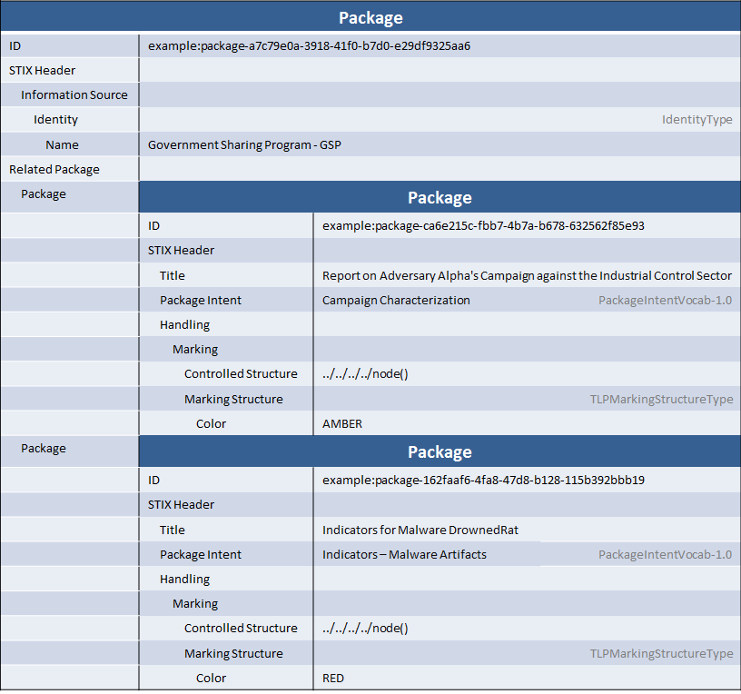

Although not always considered as important as the content itself, the packaging of cyber threat intelligence can often be very important. A basic title, intent, and description of the data is of course important, but other metadata can include data handling instructions, information about the source of the data, and information about how the data was generated. This idiom describes representing a bundle of content coming from one source but containing several unrelated reports.

## Scenario

In this scenario, two unrelated threat reports are distributed by a government sharing program via a single document at the same time. This was considered easier from an operational perspective than just distributing them separately, but other than that they are not related at all. The first report is a high-level report on an adversary's campaign against a particular industry sector while the second is a set of indicators for a piece of malware.

## Data model

### STIX Packages and Shared Context

STIX packages, which are sometimes called "reports", are a way to give a shared context to a set of STIX content. In many cases, that shared context is very rich and meaningful and the package is published, distributed, and consumed with the STIX Package wrapper as a distinct single context. For example, a threat report that gets distributed by itself by a threat intelligence vendor could be distributed as a single STIX package.

In other cases, it's useful to distribute content with varying levels of shared context. A threat report with multiple sub-reports (chapters), for example, has multiple levels of shared context. All of the context belongs to the same report and is therefore by default part of that context, but in addition the content for particular chapter belongs to a more cohesive shared context for that particular chapter.

This scenario describes another common use case: distributing multiple reports at the same time as part of a scheduled release of content. For example, many sharing programs have a daily or weekly release of all of their reports. Each report is self-contained, but all are released by the same organization at the same time. This scenario also has several levels of shared context: the weekly release is one (albiet high) level of shared context while each individual report is another.

STIX 1.1 introduced the `Related Packages` field of STIX Package as a mechanism to support these types of use cases. Essentially, it allows for both hierarchical shared context (as in this scenario) as well as other types of relationships as enabled by the full graph relationship structure used by all STIX components. Essentially, STIX packages can be related together the same way that campaigns, threat actors, and the other components can.

### Representing a simple "wrapper" context

In this scenario, there are two levels of shared context:

1. Information produced by the "GSP" government sharing program and distributed every week.
2. Information as a part of each individual report.

The structuring for this content is to have the top-level context as the outer `STIX Package`. It contains information about its level of shared context, such as the name of the government sharing program.

Each individual report is represented as a `Related Package` inside the outer level `STIX Package`. Note that the individual reports are of the same STIX Package type ([STIXType](/documentation/stix/STIXType)) as the outer level report, meaning they can contain the exact metadata (shared context) as the top-level package. In this scenario, each is given a separate TLP level, package intent, and title. The `Information Source` (the name of the government sharing program) is inherited from the top-level package and does not need to be re-stated in the `Information Source` for each individual field.

One other note about this example is the XPath used in the data markings. Because each must mark only the package it is contained in, the `//node()` marking that is typically used to mark an entire document is not used: instead, a relative path traversal starting from the `Controlled Structure` node walks back up to the parent package and then marks every child of that.

## XML


<stix:STIX_Header>
    <stix:Title>Example Plain Wrapper Around Multiple Reports</stix:Title>
    <stix:Information_Source>
        <stixCommon:Identity>
            <stixCommon:Name>Government Sharing Program - GSP</stixCommon:Name>
        </stixCommon:Identity>
    </stix:Information_Source>
</stix:STIX_Header>
<stix:Related_Packages>
    <stix:Related_Package>
        <stix:Package id="example:package-ca6e215c-fbb7-4b7a-b678-632562f85e93" timestamp="2014-02-20T09:00:00.000000Z" version="1.1">
            <stix:STIX_Header>
                <stix:Title>Report on Adversary Alpha's Campaign against the Industrial Control Sector</stix:Title>
                <stix:Package_Intent xsi:type="stixVocabs:PackageIntentVocab-1.0">Campaign Characterization</stix:Package_Intent>
                <stix:Handling>
                    <markings:Marking>
                        <markings:Controlled_Structure>../../../../node()</markings:Controlled_Structure>
                        <markings:Marking_Structure xsi:type="tlpMarking:TLPMarkingStructureType" color="AMBER"/>
                    </markings:Marking>
                </stix:Handling>
            </stix:STIX_Header>                
        </stix:Package>
    </stix:Related_Package>
    <stix:Related_Package>
        <stix:Package id="example:package-162faaf6-4fa8-47d8-b128-115b392bbb19" timestamp="2014-03-26T02:01:00.000000Z" version="1.1">
            <stix:STIX_Header>
                <stix:Title>Indicators for Malware DrownedRat</stix:Title>
                <stix:Package_Intent xsi:type="stixVocabs:PackageIntentVocab-1.0">Indicators - Malware Artifacts</stix:Package_Intent>
                <stix:Handling>
                    <markings:Marking>
                        <markings:Controlled_Structure>../../../../node()</markings:Controlled_Structure>
                        <markings:Marking_Structure xsi:type="tlpMarking:TLPMarkingStructureType" color="RED"/>
                    </markings:Marking>
                </stix:Handling>
            </stix:STIX_Header>
        </stix:Package>
    </stix:Related_Package>
</stix:Related_Packages>


[Full XML](plain-wrapper-around-multiple-packages.xml)

## Python


from stix.core import STIXPackage, STIXHeader
from stix.common import InformationSource, Identity
from stix.data_marking import Marking, MarkingSpecification
from stix.extensions.marking.tlp import TLPMarkingStructure

alpha_package = STIXPackage()
alpha_package.stix_header = STIXHeader()
alpha_package.stix_header.title = "Report on Adversary Alpha's Campaign against the Industrial Control Sector"
rat_package.stix_header.package_intent = "Campaign Characterization"
alpha_package.stix_header.handling = Marking()

alpha_marking = MarkingSpecification()
alpha_marking.controlled_structure = "../../../../node()"
alpha_tlp_marking = TLPMarkingStructure()
alpha_tlp_marking.color = "AMBER"
alpha_marking.marking_structures.append(alpha_tlp_marking)
alpha_package.stix_header.handling.add_marking(alpha_marking)

rat_package = STIXPackage()
rat_package.stix_header = STIXHeader()
rat_package.stix_header.title = "Indicators for Malware DrownedRat"
rat_package.stix_header.package_intent = "Indicators - Malware Artifacts"
rat_package.stix_header.handling = Marking()

bravo_marking = MarkingSpecification()
bravo_marking.controlled_structure = "../../../../node()"
bravo_tlp_marking = TLPMarkingStructure()
bravo_tlp_marking.color = "RED"
alpha_marking.marking_structures.append(bravo_tlp_marking)
rat_package.stix_header.handling.add_marking(bravo_marking)
    
stix_package = STIXPackage()
info_src = InformationSource()
info_src.identity = Identity(name="Government Sharing Program - GSP")
stix_package.stix_header = STIXHeader(information_source=info_src)
stix_package.related_packages.append(alpha_package)
stix_package.related_packages.append(rat_package)

print stix_package.to_xml()


[Full Python](plain-wrapper-around-multiple-packages.py)

## Further Reading

* [STIX Package](/documentation/stix/STIXType)
