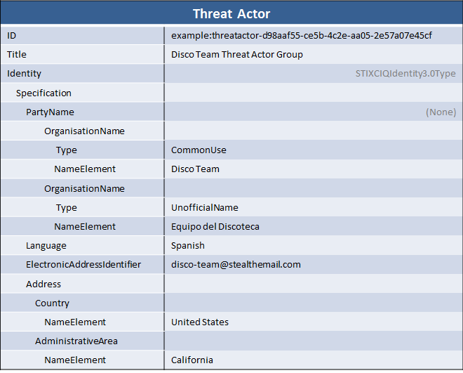

Although many smaller threat intelligence programs do not consider threat actor attribution and identification as part of their core mission, multiple threat intelligence providers and other large organizations do practice threat actor attribution and include those characterizations in their threat intelligence. For example, Mandiant released their [report](http://intelreport.mandiant.com/) on the APT1 threat actor which included a characterization of that actor's identity.

## Scenario

In this scenario, the STIX represents a threat actor group named "Disco Team" that operates primarily in Spanish. They use the e-mail alias "disco-team@stealthemail.com" publicly and are known alternatively as "Equipo del Discoteca". Several references indicate that they are based primarily in Southern California.

## Data model

Threat actor identification is, as you would expect, represented using the STIX [Threat Actor](/documentation/ta/ThreatActorType) component. More specifically, the `Identity` field, which uses the [IdentityType](/documentation/stixCommon/IdentityType) extension point, is the field that contains information about the identity of the actor. Other fields in threat actor describe what the actor targets, how sophisticated it is, and other information about it.

The STIX default extension for identity is [OASIS CIQ](https://www.oasis-open.org/committees/tc_home.php?wg_abbrev=ciq) implemented via the [CIQIdentity3.0InstanceType](/documentation/stix-ciqidentity/CIQIdentity3.0InstanceType). Using this extension point, the threat actor identity is characterized in CIQ within the `Specification` field.

## XML





## Further Reading

* [Threat Actor Component](/documentation/ta/ThreatActorType)

Much of this idiom focused on using the OASIS CIQ standard to represent information about a threat actor's identity. For further information and full documentation on CIQ, download the release from OASIS [here](https://www.oasis-open.org/committees/tc_home.php?wg_abbrev=ciq#download).