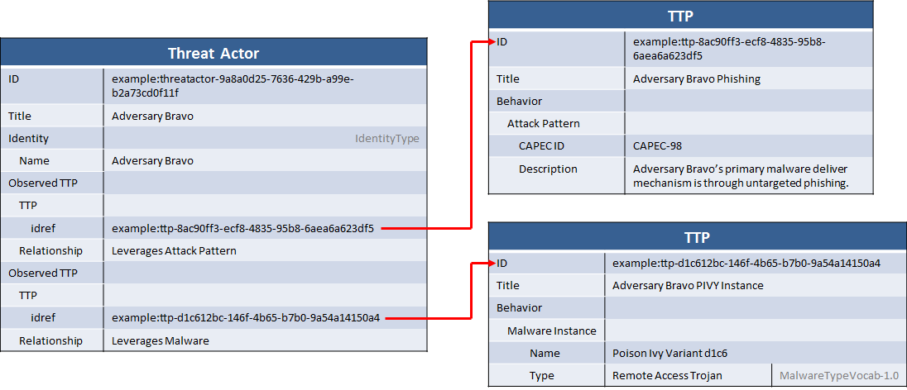

A large part of the reason for doing threat actor attribution and correlation is to develop an understanding of the adversary behavior in order to better defend against those types of attacks. In many cases, adversary behavior can be characterized by the types of attack patterns they typically use: for example, using spear phishing as a delivery mechanism for malware is an attack pattern. In other cases, behavior can be described based on the malware that the adversary typically uses.

## Scenario

This scenario represents a threat actor known as "Adversary Bravo". Adversary Bravo is known to use phishing attacks to deliver remote access malware to the targets. The malware variety they typically use is a variant on the Poison Ivy malware.

## Data model

The threat actor representation itself is fairly simple for this idiom: the `Title` is set to "Adversary Bravo" and the basic STIX identity construct is used to name the threat actor. Unlike the [threat actor group identity](/idioms/threat-actor/identity-group) idiom, in this case the CIQ extension to the identity extension point is not used. Not enough is known about this particular threat actor to justify using CIQ (or, more likely, the organization producing this STIX does not deal with threat actor identity information) so the simple `Name` field is used instead.

Adversary behavior, including attack patterns and malware, are represented in STIX using the [TTP](/documentation/ttp/TTPType) component's `Behavior` field. Malware can be described at a high level by using the basic `Malware Instance` field and the [MalwareInstanceType](/documentation/ttp/MalwareInstanceType). For this PIVY variant, the `Name` is set to "Poison Ivy Variant d1c6" and the `Type` field is set to "Remote Access Trojan", which is a value in the default STIX vocabulary for that field ([MalwareTypeVocab-1.0](/documentation/stixVocabs/MalwareTypeVocab-1.0)). More advanced usages of this type are demonstrated in the [MAEC characterization](/idioms/ttp/maec-malware) idiom, which describes how to use the same structure to fully describe the malware's behavior using [MAEC](http://maec.mitre.org).

It's technically possible to use a single TTP to represent both an attack pattern and a piece of malware, however combining distinct concepts into single components makes pivoting data in the future much more difficult. For example, if it's later determined that the same PIVY variant is used by a different threat actor it's useful to have it in a separate TTP in order to relate both threat actors to it (and only Adversary Bravo to the attack pattern). To make sure this works from the start, it's generally better to split distinct concepts into separate components. This primarily comes up in representing TTPs but the same suggestion holds true for all components.

So rather than adding an attack pattern section to the malware TTP, a new TTP was used that contains just the attack pattern. The attack pattern, described using [AttackPatternType](/documentation/ttp/AttackPatternType), contains a `CAPEC ID` and a `Description`. [CAPEC](http://capec.mitre.org) is a dictionary of potential attack patterns, so in this case by looking in that dictionary the producer was able to see that "CAPEC-98" is the ID for phishing. The best way to find the correct CAPEC is to use a generic search engine like Google or to use the CAPEC website. Other than just the CAPEC ID, the attack pattern `Description` field is filled in with more specific information about how the phishing attacks are executed.

Finally, the `Observed TTP` list inside the threat actor is used to relate the threat actor to the two TTPs. For the malware TTP, the `Relationship` descriptor "Leverages Malware" is used while for the attack pattern TTP "Leverages Attack Pattern" is used.

Taken together, the three constructs represent the threat actor and the known malware/attack patterns leveraged by that actor.

## XML


    <stix:TTPs>
        <stix:TTP id="example:ttp-8ac90ff3-ecf8-4835-95b8-6aea6a623df5" xsi:type='ttp:TTPType' version="1.1">
            <ttp:Title>Adversary Bravo Phishing</ttp:Title>
            <ttp:Behavior>
                <ttp:Attack_Patterns>
                    <ttp:Attack_Pattern capec_id="CAPEC-98">
                        <ttp:Description>Adversary Bravo's primary malware deliver mechanism is through untargeted phishing.</ttp:Description>
                    </ttp:Attack_Pattern>
                </ttp:Attack_Patterns>
            </ttp:Behavior>
        </stix:TTP>
        <stix:TTP id="example:ttp-d1c612bc-146f-4b65-b7b0-9a54a14150a4" xsi:type='ttp:TTPType' version="1.1">
            <ttp:Title>Adversary Bravo PIVY Instance</ttp:Title>
            <ttp:Behavior>
                <ttp:Malware>
                    <ttp:Malware_Instance id="example:malware-1621d4d2-b67d-11e3-ba9e-f01faf20d111">
                        <ttp:Type xsi:type="stixVocabs:MalwareTypeVocab-1.0">Remote Access Trojan</ttp:Type>
                        <ttp:Name>Poison Ivy Variant d1c6</ttp:Name>
                    </ttp:Malware_Instance>
                </ttp:Malware>
            </ttp:Behavior>
        </stix:TTP>
    </stix:TTPs>
    <stix:Threat_Actors>
        <stix:Threat_Actor id="example:threatactor-9a8a0d25-7636-429b-a99e-b2a73cd0f11f" xsi:type='ta:ThreatActorType' version="1.1">
            <ta:Title>Adversary Bravo</ta:Title>
            <ta:Identity id="example:Identity-1621d4d4-b67d-11e3-9670-f01faf20d111">
                <stixCommon:Name>Adversary Bravo</stixCommon:Name>
            </ta:Identity>
            <ta:Observed_TTPs>
                <ta:Observed_TTP>
                    <stixCommon:Relationship>Leverages Attack Pattern</stixCommon:Relationship>
                    <stixCommon:TTP idref="example:ttp-8ac90ff3-ecf8-4835-95b8-6aea6a623df5"/>
                </ta:Observed_TTP>
                <ta:Observed_TTP>
                    <stixCommon:Relationship>Leverages Malware</stixCommon:Relationship>
                    <stixCommon:TTP idref="example:ttp-d1c612bc-146f-4b65-b7b0-9a54a14150a4"/>
                </ta:Observed_TTP>
            </ta:Observed_TTPs>
        </stix:Threat_Actor>
    </stix:Threat_Actors>


[Full XML](threat-actor-leveraged-attack-patterns-and-malware.xml)

## Python


from stix.core import STIXPackage
from stix.threat_actor import ThreatActor
from stix.indicator import Indicator
from stix.common import Identity
from stix.common.related import RelatedTTP
from stix.ttp import TTP, Behavior
from stix.ttp.behavior import MalwareInstance, AttackPattern

stix_package = STIXPackage()
ttp_phishing = TTP(title="Adversary Bravo Phishing")

attack_pattern = AttackPattern()
attack_pattern.capec_id = "CAPEC-98"
attack_pattern.description = ("Adversary Bravo's primary malware delivery "
                              "mechanism is through untargeted phishing")

ttp_phishing.behavior = Behavior()
ttp_phishing.behavior.add_attack_pattern(attack_pattern)

ttp_pivy = TTP()
malware_instance = MalwareInstance()
malware_instance.add_name("Poison Ivy Variant d1c6")
malware_instance.add_type("Remote Access Trojan")

ttp_pivy.behavior = Behavior()
ttp_pivy.behavior.add_malware_instance(malware_instance)

ta_bravo = ThreatActor(title="Adversary Bravo")
ta_bravo.identity = Identity(name="Adversary Bravo")

related_ttp_phishing = RelatedTTP(TTP(idref=ttp_phishing.id_), relationship="Leverages Attack Pattern")
ta_bravo.observed_ttps.append(related_ttp_phishing)

related_ttp_pivy = RelatedTTP(TTP(idref=ttp_pivy.id_), relationship="Leverages Malware")
ta_bravo.observed_ttps.append(related_ttp_pivy)

stix_package.add_ttp(ttp_phishing)
stix_package.add_ttp(ttp_pivy)
stix_package.add_threat_actor(ta_bravo)

print stix_package.to_xml()


[Full Python](threat-actor-leveraging-attack-patterns-and-malware.py)

## Further Reading

* [Threat Actor Component](/documentation/ta/ThreatActorType)
* [TTP Component](/documentation/ttp/TTPType)

This idiom can be composed with the [C2 indicator](/idioms/indicator/c2-indicator) idiom to represent both the C2 infrastructure itself (as here) and the set of indicators for that infrastructure. Simply replace the TTP in that idiom, which only has a title, with something similar to the TTP in this idiom that includes a structured description of the C2 range.