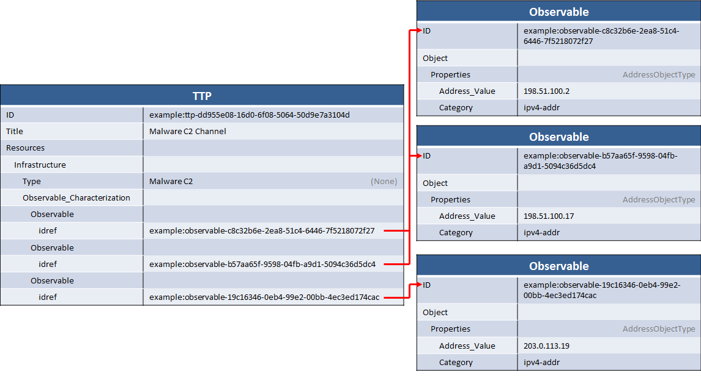

Adversary infrastructure is the set of fixed resources used by the adversary to carry out cyber attacks and exploitations. An understanding of adversary infrastructure is helpful to network defenders and security operations teams because they can help drive attribution and correlation as well as serve as a source of indicators of malicious activity. In this example, a knowledge of the adversary's command and control (C2) infrastructure is described using the [TTP](/documentation/ttp/TTPType) component.

## Scenario

This scenario represents a set of 5 IP addresses that are known C2 for an adversary's remote access mechanism. The IPs (198.51.100.2, 198.51.100.17, 203.0.113.19, 203.0.113.12, and 192.0.2.22) are not in any one subnet.

## Data model

Adversary infrastructure is represented using the [InfrastructureType](/documentation/ttp/InfrastructureType) subcomponent of [TTP](/documentation/ttp/TTPType). It allows you to describe infastructure using a combination of some metadata fields in STIX (such as infrastructure type, title, and description) and CybOX [Observables](/documentation/cybox/ObservableType) to represent the technical information about the infrastructure.

The infrastructure `Type` is a controlled vocabulary field. In this case the default vocabulary, [AttackerInfrastructureTypeVocab-1.0](/documentation/stixVocabs/AttackerInfrastructureTypeVocab-1.0), does not contain an appropriate value for malware C2 and so rather than using that vocabulary the field just sets the value to "Malware C2" and leaves the vocabulary blank. The title and description fields are not used, although the TTP's `Title` is set to "Malware C2 Channel". Setting the TTP title vs. the infrastructure title is a judgment call, but generally one or the other should be set at minimum and if the TTP describes more than one thing both should be used to distinguish them. In this case the TTP only describes one thing, so it's sufficient to just use the TTP title.

The actual IP addresses are represented in CybOX within the `Observable Characterization` field. Because these are instance observables (i.e. instances of IP addresses, not patterns) separate observables are used rather than using the `Apply Condition` field. 5 observables are created, with 5 objects, with 5 properties for [Address Objects](/documentation/AddressObj/AddressObjectType). Each set of properties includes the `Address Value` field set to the IP address and the `Category` field set to IPV4 address.

## XML





## Further Reading

* [TTP Component](/documentation/ttp/TTPType)
* [InfrastructureType](/documentation/ttp/InfrastructureType)

This idiom can be composed with the [C2 indicator](/idioms/indicator/c2-indicator) idiom to represent both the C2 infrastructure itself (as here) and the set of indicators for that infrastructure. Simply replace the TTP in that idiom, which only has a title, with something similar to the TTP in this idiom that includes a structured description of the C2 range.