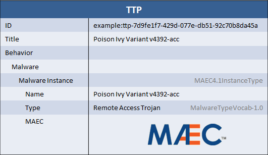

Analyzing malware behavior is an important part of any threat intelligence organization's job. Often, malware analysis tools will be able to output that information into a structured format called [MAEC](http://maec.mitre.org). MAEC (Malware Attribute Enumeration and Classification) is a language similar to STIX that is used to describe malware behavior at a very low level. When representing threat intelligence in STIX, it can often be useful to include a full representation of the malware behavior using MAEC in order to share it with other parties or relate its behavior to other pieces of intelligence in STIX.

## Scenario

In this scenario, the STIX describes a particular variant of Poison Ivy by giving it a name, a type, and a full characterization in MAEC.

## Data model

The portion of the TTP data model that is used to represent malware is [MalwareInstanceType](/documentation/ttp/MalwareInstanceType), which is represented as a list of `Malware Instance` fields inside the TTP [BehaviorType](/documentation/ttp/BehaviorType) structure.

[MalwareInstanceType](/documentation/ttp/MalwareInstanceType) is a STIX extension point that can either be used as-is to represent basic information (name, type) about malware or can be extended to represent full malware expressions. The STIX default extension is the [MAEC4.1InstanceType](/documentation/stix-maec/MAEC4.1InstanceType) extension that uses MAEC to characterize the malware.

## XML





## Python


from stix.ttp import TTP, Behavior
from stix.extensions.malware.maec_4_1_malware import MAECInstance

maec_malware_instance = MAECInstance()
maec_malware_instance.add_name("Poison Ivy Variant v4392-acc")
maec_malware_instance.add_type("Remote Access Trojan")
maec_malware_instance.maec = __insert_maec_package_etree__

ttp = TTP(title="Poison Ivy Variant v4392-acc")
ttp.behavior = Behavior()
ttp.behavior.add_malware_instance(maec_malware_instance)

print ttp.to_xml()


[Full Python](malware-characterization-using-maec.py)

## Further Reading

* [MAEC](http://maec.mitre.org)
* [TTP Component](/documentation/ttp/TTPType)
* [MalwareInstanceType](/documentation/ttp/MalwareInstanceType)

An example of using this type of structure in another context is found in the [malware hash](/idioms/indicator/malware-hash) idiom. The simple representation described there could be replaced with a full MAEC characterization as described here.